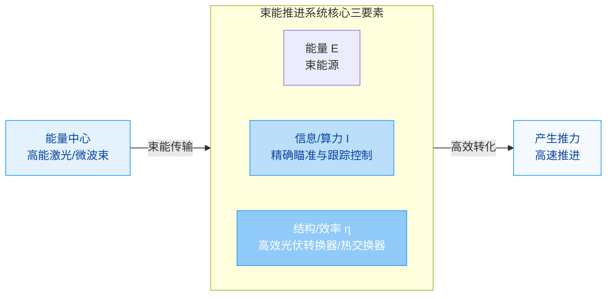
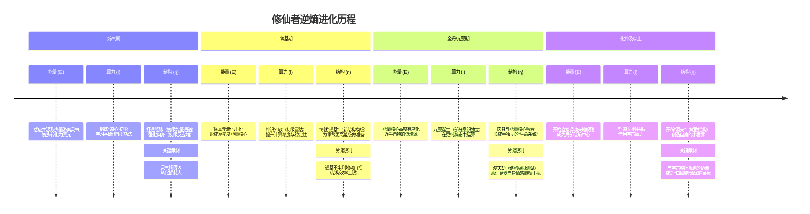

# 逆熵之路：力量体系构建的第一性原理

## 核心摘要

本文探讨了从第一性原理出发，如何为科幻、奇幻、修仙等虚构世界构建自洽的力量体系与阶层设定。

**核心框架**：任何文明或个体的力量本质上是三个要素的乘积：

$$P = E \times I \times \eta$$

- **能量(Energy, E)**：做功的潜力，力量的燃料与源泉
- **算力/信息(Intelligence, I)**：做功的方向，力量的智慧与控制
- **结构/效率(Structure, η)**：将潜力转化为现实的效率，力量施展的舞台与载体

**内容涵盖**：
- 力量体系设计的五大维度与经典模型(D&D、修仙、克苏鲁、科技等)
- 力量来源的六大类型及其变体(神秘学、科技、修炼、赐予、概念等)
- 基于韦伯、马克思等理论的社会阶层构建方法
- 卡尔达肖夫指数与巨型结构(戴森球、束能推进)的工程学印证
- 修仙/魔幻体系的熵增-熵减映射与具体限制设计

**核心价值**：通过引入"结构"与"熵"的概念，将玄幻力量体系与物理学、热力学、信息论连接，为创作者提供既具科学质感又富哲学深度的世界观基础，让"限制"成为故事的引擎。

---

## 原始问题

有没有什么经典或者方法论讨论力量体系和阶层应该如何设定？神秘学/科幻/各种小说里面力量可以有什么来源？
抛开各种小说的设定，从第一性原理出发，任何一个文明、一个个体想要做到更高的文明层次/力量层次本质上需要什么？

---

## 一、力量体系设计的方法论与经典模型

你提的这个问题非常核心，无论是构建一个奇幻世界、写一部科幻小说，还是设计一款游戏，**力量体系与阶层设定**都是骨架与血肉，直接决定了世界的质感、故事的冲突与人物的动力。我会结合经典理论、方法论和一些创意灵感，为你梳理一番。

力量体系的设计远不止是划分等级那么简单，它需要与你的世界观、主题和叙事深度绑定。

### 1. 力量体系的核心设计维度

一个完整的体系通常需要回答以下问题，它们构成了一个**闭环**，任何一环的缺失都会让体系显得单薄或矛盾：

```mermaid
flowchart TD
    A[力量来源<br>"力量从哪里来？"] --> B[获得与成长方式<br>"如何得到并变强？"]
    B --> C[表现形式与限制<br>"力量长什么样？有何代价？"]
    C --> D[阶层与权力结构<br>"力量如何分配社会？"]
    D --> E[叙事主题与哲学思考<br>"力量对世界与人性意味着什么？"]
    E -.-> A
```

- **力量来源**：这是力量的"**本质论**"，决定了力量的哲学属性和世界观根基。
- **获得与成长方式**：这是力量的"**认识论**"，规定了个体如何理解和掌握力量，直接关联成长线。
- **表现形式与限制**：这是力量的"**现象学**"，是读者/玩家最直观感受的部分，包括表现形式、消耗、代价、限制等。
- **阶层与权力结构**：这是力量的"**政治学**"，力量如何在社会中分配、流动和产生权威。
- **叙事主题与哲学思考**：这是力量的"**价值论**"，力量体系最终要服务于你想探讨的主题（如代价、责任、异化、自由等）。

### 2. 经典力量体系模型参考

许多经典作品为我们提供了成熟的设计范式，它们的核心思路值得借鉴：

| 体系名称 | 核心逻辑 | 关键特点 | 经典代表 | 适用场景 |
| :--- | :--- | :--- | :--- | :--- |
| **D&D式职业系统** | **模块化专精** | 严格的**职业**划分（战士、法师、盗贼等），每个职业有独特的能力树、成长路径和定位。强调**团队协作**与**角色定位**。 | 《龙与地下城》(D&D)、《博德之门》系列 | **TRPG**、**CRPG**、强调团队冒险和角色扮演的故事 |
| **武侠/仙侠式境界修炼** | **积累与突破** | 划分明确的**境界**（如后天、先天、金丹、元婴），每个境界有**质变**。强调**资源**（灵石、丹药）、**机缘**、**悟性**。 | 《凡人修仙传》、《搜神记》 | **东方玄幻**、**仙侠**、强调个体修行和逆天改命的故事 |
| **克苏鲁式神秘知识** | **代价与腐蚀** | 力量来自**外神**或**不可名状的存在**，获取知识即靠近**疯狂**。强调**理智值**（SAN）、**禁忌**和**不可名状的恐怖**。 | 《克苏鲁的呼唤》系列、《诡秘之主》 | **克苏鲁神话**、**黑暗奇幻**、探讨知识与代价、宇宙恐怖的故事 |
| **漫威式基因变异/科技** | **多样性与不确定性** | 力量来自**基因突变**（X基因）、**科技**（装甲、药剂）或**宇宙能量**（无限宝石）。个体差异极大，**觉醒方式**随机。 | 漫威漫画/电影宇宙 | **超级英雄**漫画/电影、强调个体独特性和外部起源的故事 |
| **新世纪福音战士式同步率** | **适配与精神连接** | 驾驶巨大生物兵器（EVA）需要**驾驶员**与机体的**同步率**，这与其**心理状态**、**血缘**（母亲灵魂）强相关。 | 《新世纪福音战士》 | **机甲**、**心理悬疑**、探讨自我、存在与羁绊的故事 |

### 3. 力量体系设计的实用原则

- **一致性**：力量体系内部的规则必须自洽。一旦制定了规则（如魔法消耗法力值），就**不要轻易破坏**，否则会破坏读者的信任。
- **平衡性与冲突性**：**绝对平衡**的设计往往乏味（如所有元素完全相克）。**不平衡**的设计能创造天然的冲突（如光系克暗系，但暗系有其他优势）。**代价**是平衡的高级形式，强大的能力往往伴随着巨大的风险或限制（如《钢之炼金术师》的"等价交换"）。
- **成长性与可视性**：角色变强的过程应该是**渐进且可感知的**。这可以通过**等级**、**境界**、**新能力**的解锁或**原有能力的强化**来体现。清晰的能力升级路径能提供持续的成就感。
- **服务于叙事**：**力量体系是为故事服务的**，而不是反过来。它应该能推动情节发展、塑造人物性格、深化主题，而不是成为束缚故事的枷锁。问问自己，这个体系如何让主角更难达成目标？它如何创造新的困境？

## 二、力量来源的无限可能：从神秘学到科幻

力量来源是体系的基石，决定了世界的质感。以下是几种常见的来源及其变体，希望能给你一些灵感：

| 来源类型 | 核心逻辑 | 常见表现形式 | 典型作品/设定 | 变体与融合思路 |
| :--- | :--- | :--- | :--- | :--- |
| **神秘学/魔法** | **借力与共鸣**：个体与宇宙中某种超自然力量（元素、星辰、神灵、远古存在）建立连接，通过**仪式、符号、咒语**等借用其力量。 | 元素操控、诅咒、祝福、召唤、预言、灵魂魔法 | 《龙与地下城》的魔法体系、《哈利·波特》的魔咒、《指环王》的精灵魔法 | **科学化魔法**：将魔法视为一种有待研究的**自然规律**。**情绪魔法**：力量与特定情绪强烈绑定。**血统魔法**：力量与血脉传承相关，带来家族或种族差异。 |
| **科技/科幻** | **改造与利用**：通过**基因工程**（X基因、超级士兵）、**机械植入**（赛博格）、**能量操控技术**（无限宝石、戴森球）或**量子效应**来获得或模拟超自然力量。 | 超能力、激光武器、力场、机甲、时间旅行、维度跳跃 | 《漫威宇宙》的科技与变异、《沙丘》的香料与预知、《赛博朋克2077》的义体 | **生物科技**：通过**药物**或**病毒**大规模引发变异（如《X战警》）。**纳米技术**：纳米机器人赋予各种能力（如《钢铁侠》的战甲）。**意识上传**：将意识融入网络，获得数据处理和控制能力（如《攻壳机动队》）。 |
| **内在/修炼** | **开发与觉醒**：力量源于**个体生命**或**精神**的潜在能量，通过**修炼**（冥想、锻炼、悟道）或**极端情感/信念**的刺激而觉醒和强化。 | 气功、念力、超速自愈、预知、分身、元素亲和（但非魔法） | 《龙珠》的气、《海贼王》的霸气、《一拳超人》的极限突破 | **情绪驱动**：强烈情感（愤怒、爱、恐惧）是力量爆发的开关。**灵魂力量**：力量源于灵魂的强度和纯度（如《死神》的灵压）。**概念武装**：将某种抽象概念（"燃烧"、"速度"、"规则"）本身具象化为武器或能力。 |
| **外部/赐予** | **契约与授权**：力量来自**外神**、**宇宙法则**、**高位存在**或**系统**的主动赋予，个体与之签订契约或完成特定任务。 | 神术、恶魔契约、系统面板、职业觉醒 | 《诡秘之主》的序列途径、《Re:从零开始的异世界生活》的死亡回归、《转生史莱姆》的"大贤者" | **系统流**：力量来自一个神秘的"系统"面板，通过完成任务、点数升级获得（常见于网文）。**神恩/诅咒**：力量来自神明，但伴随严苛的**教条**、**信仰要求**或**身体异变**。**寄生/共生**：力量来自与某个强大存在（如寄生兽、共生体）的融合，需平衡双方意志。 |
| **概念/规则** | **定义与操控**：个体能够感知并直接**操纵宇宙或世界的底层概念**（如时间、空间、因果、命运、死亡、创造），力量来源于对"规则"的违背或利用。 | 时间停止、空间扭曲、因果律武器、概念抹除 | 《魔法禁书目录》的幻想杀手、《Fate》系列的固有结界、《JOJO的奇妙冒险》的替身能力（很多是概念性） | **规则系**：能力效果由一套复杂的**自身规则**定义，看似简单但应用极其灵活（如《我的英雄学院》的"个性"）。**言灵/真名**：掌握事物的**真名**或**言出法随**，通过语言定义现实（如《地海传说》的魔法）。 |

**灵感混合与突破**：最精彩的力量来源往往是**混合体**。例如：
- **科技+神秘学**：用科技手段解析并模拟魔法仪式（如龙晶既是魔法资源，又能被科技锻造）。
- **内在+外部**：个体通过修炼激发内在潜能，最终能与外部宇宙力量共鸣，甚至借用其力量（许多东方玄幻作品）。
- **赐予+代价**：力量是"赐予"的，但"代价"是必须遵循的严苛"规则"，从而形成独特的战斗风格（如《死神》的始解卍解，需要与斩魄刀对话并理解其真名）。

## 三、阶层设定：力量如何塑造社会结构

力量体系一旦确立，必然会对社会阶层产生决定性影响。**力量差异是社会分层最原始、最强大的驱动力之一**。设计阶层时，可以借鉴社会学理论，让虚构的社会更真实、更深刻。

### 1. 经典的社会分层理论及其应用

社会学家提供了分析阶层结构的工具，它们完全适用于虚构世界：

| 理论视角 | 核心观点 | 在虚构世界中的体现 |
| :--- | :--- | :--- |
| **马克思的阶级理论** | **生产资料**的占有是阶级划分的基础。阶级斗争是社会发展的动力。 | **魔法材料/科技资源**的垄断集团 vs. **无产者**（无魔法/无技术者）。例如，掌握稀有魔法矿石的公会联盟与普通矿工。 |
| **韦伯的"三位一体"分层** | **阶级（经济）**、**地位团体（声望）**、**政党（权力）** 是三个独立的分层维度，但常交织。 | - **经济**：财富积累（魔法师公会、科技巨头）。<br>- **声望**：职业身份（高贵的龙骑士、被歧视的黑暗法师）、血统纯度。<br>- **权力**：政治机构（长老会、帝国军队）、秘密组织。**贵族**可能同时拥有三样，而**暴发户**（新晋强大力量者）可能只有经济和权力，缺乏声望，引发冲突。 |
| **迪尔凯姆的功能主义** | 社会分工形成不同职业和阶层，每个阶层对社会的**功能**不同，从而获得相应地位和报酬。 | **强大的战斗职业**（战士、法师）因保卫社会获得高地位；**后勤研发职业**（炼金术士、科学家）因提供关键支持获得财富；**基础生产者**（农民、工人）地位相对较低，但社会不可或缺。 |

### 2. 基于力量的常见阶层模型

- **金字塔模型**：**最常见**。少数**最强者**（神级、传说级）统治顶端，其下是**精英阶层**（各级强者），再往下是**平民**（无力量或弱力量），底层是**奴隶**或**被遗弃者**。**冲突**源于：上层压迫、下层渴望力量、中层试图向上或维持现状。
- **循环/平衡模型**：力量来源是**循环**或**平衡**的，破坏平衡会导致灾难。各阶层（如元素守护者）**相互制衡**，没有绝对最强，只有**动态平衡**。**冲突**源于：平衡被破坏（天灾、人为），引发各方争夺或修复平衡的斗争。
- **技术/知识垄断模型**：力量来自**复杂知识**或**先进技术**，而知识被**严格垄断**（如法师塔、研究院、教会）。**阶层划分**直接对应**知识获取权限**。**冲突**源于：知识泄露、异端探索、打破垄断的尝试。
- **血统/种姓模型**：力量与**血脉**或**出生种姓**强绑定，几乎无法改变。社会被划分为**世袭的阶层**。**冲突**源于：对"种姓制度"的质疑、异族通婚产生的"混血儿"、对"高贵血统"的挑战。

### 3. 设计阶层的实用思路

- **力量门槛与准入机制**：什么决定了你能进入哪个阶层？是**天赋**（如魔法亲和力）、**资源**（如能购买昂贵训练）、**血统**（如家族传承），还是**成就**（如通过试炼）？**门槛越高，阶层固化越严重**。
- **流动与封闭**：阶层是否**可以流动**？**如何流动**？是"**英雄不问出处**"（如通过冒险和奇遇打破天花板），还是"**龙生龙，凤生凤**"（血统决定一切）？**封闭的体系更压抑，开放的体系更冒险**。
- **权力与力量的对应关系**：**社会权力**是否必然与**个人力量**挂钩？还是可能出现"**有力量无权力**"（被统治的强者，如禁卫军）和"**无力量有权力**"（通过政治手腕统治的弱者，如元老院长老）？**这种错位是极佳的戏剧冲突来源**。
- **阶层文化与意识形态**：不同阶层是否有不同的**文化习俗、价值观、审美甚至语言**？上层是否自诩"**文明**"，贬低下层为"**野蛮**"？下层是否有自己独特的**反抗文化**或**生存智慧**？这能极大丰富世界观。

## 四、开始构建你的力量体系与阶层：实用指南

现在，让我们将上述理论转化为行动，一步步搭建属于你的体系。

```mermaid
flowchart LR
    A[第一步: 核心灵感与定位<br>确定核心风味与主题] --> B[第二步: 定义力量来源与本质<br>回答"力量是什么？"]
    B --> C[第三步: 设计获得、成长与代价<br>规划"如何变强？什么代价？"]
    C --> D[第四步: 规划表现形式与限制<br>描绘"力量长什么样？如何用？"]
    D --> E[第五步: 构建社会阶层与权力结构<br>分析"力量如何分配社会？"]
    E --> F[第六步: 注入叙事主题与哲学思考<br>深化"力量意味着什么？"]
    F --> G[第七步: 案例与人物测试<br>通过具体角色检验体系]
    G --> H[第八步: 迭代与打磨<br>修正矛盾，强化特色]
```

1. **从核心灵感出发**：你最想写一个**什么样的故事**？是个人成长的史诗，还是对权力与异化的思考？核心灵感（如"科技与魔法共生"、"情绪即是力量"）会像一颗种子，长出整个体系。

2. **确定力量来源与本质**：基于上文的表格，为你的力量选择一个或混合一个核心来源。思考它的**哲学寓意**：它代表了希望？危险？秩序？混乱？

3. **设计获得与成长路径**：
    - **如何觉醒/获得**：是天生、意外、学习、赐予，还是必须经历某种仪式？
    - **如何变强**：是消耗资源（时间、金钱、稀有材料）、经历生死危机、积累知识，还是需要顿悟？
    - **代价与限制是什么**：这是**区分平庸与伟大的关键**。是消耗生命力？腐蚀心智？需要特定材料？还是随着使用次数变强但副作用也越来越大？**没有代价的力量是廉价的**。

4. **规划表现形式与限制**：
    - **力量看起来像什么**：火焰、光线、机械结构、无形的波纹、扭曲的空间？描述要**具有画面感**。
    - **如何释放**：需要吟唱、手势、媒介（魔杖、法器）、还是纯粹意念？
    - **有什么限制**：范围、距离、持续时间、冷却时间、反噬？**限制比能力本身更能定义一个角色**。

5. **构建社会阶层与权力结构**：
    - 根据力量的**稀缺性**和**可替代性**划分阶层。**力量越强大、越稀有，掌握它的人地位越高**。
    - 思考**谁掌握着力量分配的渠道**？是教会、学院、家族还是国家？他们如何**维护自己的统治**？
    - 设计**阶层间的矛盾点**：压迫、歧视、资源争夺、意识形态冲突。

6. **注入叙事主题与哲学思考**：
    - 你的力量体系最终想探讨什么？是"**力量会导致腐败**"吗？是"**真正的力量来自守护与爱**"吗？还是"**科技与自然的博弈**"？
    - 让体系为**主题服务**。例如，想探讨"异化"，就让力量最终吞噬使用者的身份；想探讨"责任"，就让强大力量必须承担重担。

7. **通过案例与人物测试**：
    - **创造几个角色**：一个顶层强者、一个中层精英、一个底层奋斗者。
    - **让他们处于同一情境**：例如，发生了一场灾难。**用你的体系解释他们会如何应对、彼此如何互动**。这能迅速发现体系中的不合理或乏味之处。
    - **赋予他们独特的动机和挣扎**：他们的力量如何影响他们的性格、目标和关系？

8. **迭代与打磨**：
    - 没有一蹴而就的完美体系。**写作或设计过程中，不断调整**。
    - **删繁就简**：过于复杂的规则会让人困惑。**保留核心机制，其余留白**。
    - **突出特色**：让你的体系有一个或几个令人印象深刻的"**钩子**"（Hook），比如独特的代价、有趣的获得方式或富有哲理的本质。

## 五、总结与最后建议

构建力量体系和阶层设定，本质上是在**创造一个关于权力、欲望和人性的实验室**。它不需要一开始就完美无缺，但需要有一个坚实的核心逻辑，并能随着你的故事不断生长。

最后给你三个小建议：

- **从"限制"而非"能力"开始构思**：先想清楚**一个人最怕失去什么**，再围绕这个设计力量的代价和限制，人物和故事会立刻变得鲜活。
- **相信"常识"与"逻辑"**：即使在幻想世界，**社会逻辑和人性逻辑依然适用**。强大者必然寻求稳定，弱者必然寻求向上，这是冲突的永恒根源。
- **为"例外"留出空间**：最精彩的故事往往发生在体系的**边缘和例外之处**——那个不符合任何阶层的流浪者，那个用禁忌知识挑战传统的异端，那个没有血统却拥有惊人天赋的天才。**他们是打破世界平衡的变量**。

---

## 六、第一性原理：能量-算力-结构的"铁三角"

你的直觉非常敏锐。确实，如果只谈**能量**（动力）和**算力**（智能），还缺少了最关键的一环——也就是将这些"潜能"转化为"现实功"的载体。

你提到的"组织结构"已经非常接近本质了，但更严谨、更底层的说法应该是：**结构（或称"秩序度/效率"）**。

如果把一个文明或个体比作一台机器，那么这三者的关系是：
- **能量** = 燃料（能跑多远？爆发力多大？）
- **算力** = 控制系统（往哪跑？如何最优路径？）
- **结构** = 引擎与车身（燃料利用率多少？能承受多大转速？会不会散架？）

没有**结构**，能量就是失控的爆炸，算力就是空转的脑电波。从第一性原理看，第三个要素是**将能量和信息"绑定"在一起的物质架构与运行效率**。

我们可以从以下三个维度来深度理解这个"结构"：

### 1. 物质维度的"结构"：硬件密度与精细度

这是力量的**物理基础**。哪怕你有无限的能量和无限的算力，如果你的身体（或文明的设施）是由豆腐渣做的，你也无法发挥力量。

**个体层面**：
- **本质**：组成个体的物质材料有多强，微观结构有多精细。
- **升级逻辑**：从**碳基**（脆弱的蛋白质结构，怕高温、怕辐射）-> **硅基**（耐高温、耐辐射）-> **强相互作用力材料**（类似《三体》的水滴，原子核紧密排列，表面绝对光滑）。
- **意义**：结构密度越高，**能量承载能力**越强。你可以爆发出更高的能量输出而不炸膛；你的运算载体（大脑/芯片）可以运行在更高的频率而不烧毁。

**文明层面**：
- **本质**：对物质的控制精度。
- **升级逻辑**：从**分子层面的操作**（化学工业）-> **原子层面的操作**（纳米技术）-> **核子层面的操作**（直接排列质子中子）。
- **意义**：如果一个文明能随意重排原子，他们就能把一吨泥土变成一吨CPU或一吨高能电池。**物质结构的操控力，决定了能量的利用效率。**

### 2. 系统维度的"结构"：内耗与效率（熵）

这是你提到的"组织结构"，但它不仅指社会架构，更指**系统内部的连接方式**。

**个体层面**：
- **本质**：神经系统的连接效率、能量传输的损耗率。
- **升级逻辑**：从**化学信号传递**（慢、有损耗）-> **电信号传递**（快、有电阻损耗）-> **量子纠缠/光子传递**（瞬时、无损耗）。
- **意义**：如果你的大脑算力是100，但神经传输损耗了90%，那你实际表现出来的智能只有10。**高效的内部结构是力量无损输出的前提。**

**文明层面**：
- **本质**：社会协作的组织形式、信息传递的保真度、经济分配的合理性。
- **升级逻辑**：从**部落/奴隶制**（极高内耗，信息依赖口耳相传）-> **科层制/法治**（降低内耗，书面记录）-> **蜂巢思维/意识联网**（零内耗，思维瞬间同步）。
- **意义**：为什么一个10亿人的文明打不过一个1亿人的文明？往往是因为组织结构更优，内耗更低，能把所有人像一个人一样协调。

### 3. 维度层面的"结构"：降维打击与拓扑结构

这是结构的终极形态。

- **本质**：利用更高维度的空间结构来压倒低维度的对手。
- **逻辑**：二维平面的生物（纸片人），无论它的能量和算力多强，都永远无法理解三维生物（你）是如何"凭空消失"（离开平面）再"凭空出现"的。
- **升级**：从三维空间结构 -> 操控四维（时间）或更高维度的拓扑结构。这已经不仅仅是材料或组织的问题，而是对**空间法则本身的结构重组**。

### 总结：力量公式的完整形态

如果要用一个公式来最终修正，力量 **P** 的完整公式应该是：

$$P = E \times I \times \eta$$

- **E (Energy)**：**能量**（做功的潜力）。
- **I (Intelligence)**：**算力/信息**（做功的方向）。
- **η (Eta - 效率/结构)**：**结构与效率**（将潜力转化为现实的比例）。

**η（结构）就是那第三个要素。**

- 一个原始人（E低, I低, η低）。
- 一个现代核电站（E高, I中, η中）。
- 一个恒星戴森球（E极高, I高, η高）。
- 一个终极文明（二向箔、水滴、歌者），它们的强大不仅仅是因为能量大、算力高，更因为它们的**η（结构）**触达了物理极限——**绝对的刚体、绝对的信息无损传输、绝对的社会零内耗**。

所以，回到你的问题：**是的，第三个是"结构"。** 在个体身上表现为**生理构造与材料学**，在文明身上表现为**社会组织制度与协作效率**。它决定了你是一个"松散的沙堆"，还是一个"紧密的钻石"。

---

## 七、卡尔达肖夫指数与"能量"的基石地位

西方科幻、未来学研究以及工程技术领域的论述，确实常常触及或隐含地支持 **"能量(Energy) - 信息/算力(Information) - 结构/效率(Structure)"** 这一铁三角模型。

**卡尔达肖夫指数（Kardashev Scale）** 是衡量文明技术等级的最著名框架，它**直接将能量（Energy）作为衡量文明层次的唯一标尺**。这本身就印证了"能量"是力量的第一性原理基础。

| 文明类型 | 能量消耗水平 | 核心含义 | 结构与效率的隐含要求 |
| :--- | :--- | :--- | :--- |
| **I 型文明** | 能够利用其**所在行星**（如地球）的全部可用能量。 | 掌控行星能源（如所有太阳能、风能、地热、核能）。 | 需要极高的**能量转化效率**和**全球范围的能量分配结构**（如智能电网），以避免能量浪费和崩溃。 |
| **II 型文明** | 能够利用其**所在恒星**（如太阳）的全部能量输出。 | 构建巨型结构（如**戴森球 Dyson Sphere**）包裹恒星，捕获其绝大部分辐射。 | 戴森球本身是**极致结构效率**的象征。它需要**前所未有的材料强度**（强相互作用力材料？）、**自我修复能力**和**精确的姿态控制**（依赖算力）。其结构设计直接决定了能量捕获效率和稳定性。 |
| **III 型文明** | 能够利用其**所在星系**（如银河系）的全部能量。 | 掌控数千亿颗恒星的能量，可能利用黑洞、星系尺度的能量网络。 | 需要跨越星际的**能量传输结构**（如星际能量网络、激光束）、**超大规模的物质工程**和**星系级的协调与控制结构**（这本身就是一个巨大的信息和算力挑战）。 |

**核心印证**：卡尔达肖夫指数**明确定义了能量的量级**，但它所描述的每一个文明等级，其**技术前提都是突破性的结构效率和智能控制**。没有后者，能量就无法被有效驾驭、利用和分配，反而会成为毁灭性的灾难。例如，一个失控的II型文明能量源（如戴森球失衡）可能会摧毁整个恒星系。

### 巨型结构与"结构效率"的极端重要性

英文世界里，对**巨型结构（Megastructures）** 的讨论，是对"结构"要素最集中、最硬核的印证。这些结构本身就是为了驾驭巨大能量而存在的。

**戴森球（Dyson Sphere）与"结构效率"**

戴森球是捕获恒星能量的终极结构。其设计讨论的核心不再是"能否收集到能量"，而是**如何用最少的材料、最稳定的结构收集最多的能量**，这直接对应 **"结构效率 (η)"**。

- **游戏与模拟社区的讨论**：在游戏《戴森球计划》（Dyson Sphere Program）的社区中，玩家们孜孜以求的正是"**最效率的戴森球设计**"，追求"**获得最大的电力输出，同时将材料成本和结构节点降至最低**"。这本质上是在优化 **E × η** 这个乘积，其中 **E** 是恒星的能量潜力，**η** 是戴森球结构的捕获与转化效率。
- **材料与结构的极限**：在现实科学讨论中，建造戴森球需要解决**材料强度**（抵抗引力坍缩）、**自我修复**（修复微陨石撞击）、**散热**（结构效率的一部分，避免过热）等极端结构问题。没有突破性的**材料科学**和**结构工程学**，戴森球就无法存在，II型文明也就无法实现。

**束能推进（Beamed Energy Propulsion）与"能量-结构"耦合**

**束能推进**技术（如激光推进、微波推进）是另一个绝佳例子，它展示了**能量、结构和算力如何紧密耦合**以实现更高层次的航天能力。

- **工作原理**：一个**中心发电站**（提供高能量，**E**）产生激光或微波束，精确地**照射到远处的航天器上**。航天器上的**接收器（光伏转换器或热交换器）**（一个精密的**结构**，**η**）将束能转化为电能或热能，再用于加热工质产生推力。
- **结构效率的关键性**：文献指出，采用束能推进后，航天器上的光伏转换器面积可以比传统太阳能帆**减小2到4个数量级**，因为激光功率密度极高且转换效率高（可达50%，远超传统太阳能的20%）。这直接归功于**更高效的光伏接收结构**，极大地减轻了航天器质量，**提升了整体推进效率**。
- **算力的作用**：**精确瞄准和跟踪**移动中的航天器，需要**强大的实时计算和控制算法（算力，I）**，以确保能量束始终准确地照射在接收器上，避免能量浪费和事故。这体现了 **E × I × η** 的乘积效应。



### 信息与算力的无处不在

虽然搜索结果中没有直接讨论"算力"的文献，但**信息与控制（Information & Computation）** 是驾驭任何复杂能量和结构系统的**神经中枢**，这一点在英文科技论述中是隐含的前提。

**作为"控制"的算力**：

在**航天器推进**的讨论中，除了化学火箭和电推进，**先进推进系统**（如核热推进、反物质火箭）的核心难点之一，就是**如何精确控制巨大的能量释放**，以避免灾难。这需要**飞控计算机、传感器网络和实时算法**（即算力）来保证稳定性。

**戴森球**本身需要**自我维持的平衡系统**，需要感知引力扰动、调节结构应力、优化能量分配，这背后是一个**巨大的分布式计算和决策网络**。

**作为"优化"的算力**：

工程师在设计更高效的**太阳能电池**、**更轻更强的复合材料**、**更优化的航天器外形**时，都依赖**计算机模拟、AI优化和大数据分析**。**算力**直接决定了**结构效率（η）** 能否被推向新的极限。

### 复杂系统与"结构"的哲学意义

在系统论和复杂科学中，**"结构"意味着秩序、组织和负熵**。

- **对抗熵增**：宇宙的天然趋势是熵增（无序）。一个文明或个体要跃升，就是要在更大的尺度上建立更**有序、更复杂、更高效的结构**，来**对抗熵增**，维持自身的存在和发展。这个"结构"本身，就是**负熵的载体**。
- **涌现性**：当能量、信息和物质以特定的**结构**组织在一起时，会涌现出单个部分所不具备的全新属性（如生命、智能）。**更高层次的力量，正是这种"涌现性"的体现**。结构是产生涌现性的关键。

### 具体案例：从化学火箭到光压之帆

让我们通过一个具体的技术演进案例，来直观地看看 **E × I × η** 如何共同推动力量层次的跃升。

| 技术代际 | 能量 (E) 来源 | 结构与效率 (η) | 信息与控制 (I) | 力量层次体现 |
| :--- | :--- | :--- | :--- | :--- |
| **化学火箭**<br>(当前主流) | 化学键能<br>(低能量密度) | **结构效率低**：<br>• 燃料箱质量占比巨大<br>• 发动机效率(~45%)<br>• 需携带全部工质 | **控制基础**：<br>• 预编程飞行<br>• 有限的姿态调整 | **行星内与邻近空间**<br>能离开行星，但难以高效星际旅行。 |
| **电推进**<br>(离子/霍尔推进器)<br>(已在卫星应用) | 电能<br>(来自太阳能或核电池)<br>(较高能量密度) | **结构效率提升**：<br>• **比冲极高**(工质利用率提升数倍)<br>• 推力微小但可持续<br>• 无需携带大量氧化剂 | **控制升级**：<br>• 需要精确的功率管理<br>• 长期轨迹优化 | **深空探测与轨道转移**<br>能执行复杂的星际探测任务，但耗时较长。 |
| **束能推进**<br>(激光/微波帆)<br>(概念研究阶段) | **远程束能**<br>(来自空间电站或巨型激光器)<br>(能量来源几乎无限) | **结构效率革命**：<br>• **无需携带燃料/工质**，航天器质量极小<br>• 接收器效率可达50%+<br>• 推力功率比极高 | **控制至关重要**：<br>• **需要超远程、高精度的瞄准与跟踪系统**<br>• 需要应对光压变化和姿态控制 | **恒星际航行**<br>**可能实现近光速飞行**，使人类首次具备恒星际旅行能力。 |
| **未来构想**<br>(反物质、黑洞等) | **质量-能量直接转化**<br>(能量密度达到物理极限) | **结构效率终极化**：<br>• 需要能够承受极端环境的**未知材料结构**<br>• 需要完美约束反物质的**磁笼结构** | **控制成为核心**：<br>• **需要AI级别的实时决策**来管理微秒级的能量脉冲<br>• 任何错误都意味着毁灭 | **星系文明**<br>具备在星系尺度上自由移动和开发资源的能力。 |

**案例解读**：从化学火箭到束能推进的飞跃，**能量的来源（E）变得更强大和远程**，**但真正的跃升来自于结构效率（η）的质变**——从笨重、低效的化学推进，到轻便、高效的工质利用，再到无需携带工质的光压推进。而**每一次结构的优化，都必然伴随着更高级、更精确的信息控制（I）**。三者缺一不可。

### 结论：英文世界的印证总结

综合来看，英文世界的讨论从多个角度印证了"**能量-算力-结构**"三要素模型：

1. **卡尔达肖夫指数**确立了**能量（E）** 作为文明层级**基础标尺**的地位。
2. **对巨型结构（如戴森球）** 和**先进航天技术（如束能推进）** 的工程化讨论，将**结构效率（η）** 和**材料科学**推向了舞台中央，证明了**没有极致的结构，就无法驾驭巨大的能量**。
3. **所有对复杂系统的控制、优化和稳定性分析**，都隐含地承认了**信息与算力（I）** 作为**神经中枢**的不可或缺性，它是协调能量与结构、避免混乱、涌现智能的根本。

因此，在第一性原理的视角下，任何一个文明或个体想要跃升，必然是在**能量、算力、结构**这三个维度上同时实现突破，并优化它们的乘积 **E × I × η**。**结构是力量施展的舞台和载体，算力是力量的智慧与控制，能量是力量的燃料与源泉。** 三者共同构成了通向更高层次文明的阶梯。

---

## 八、修仙/魔幻体系的映射：熵减 vs 熵增

将修仙与魔幻体系映射到"能量-算力-结构"这个三要素模型上，并加以限制和修改，能创造出既自洽又富有新意的世界观。这能赋予"逆天改命"和"魔法"一个物理化的、可理解的内核。

下面是一个映射框架，包含核心限制、体系差异和具体设定。

### 核心映射与限制

首先，我们用一个表格来对比科技文明与修仙/魔幻文明在三要素上的不同取向和限制。这能帮助你快速把握体系的核心差异。

| 要素 | 科技文明 (熵增路线) | 修仙/魔幻文明 (熵减路线) | **核心限制与修改** |
| :--- | :--- | :--- | :--- |
| **能量 (E)** | **开源与转化**：寻求更高效能源（化石→核聚变→反物质），追求**能量输出总量**的无限增长。 | **汲取与内敛**：从环境中汲取"灵气"、"魔力"等**低熵物质**，将其转化为并储存于自身（真元、法力），追求**个体能量密度**和**自持性**。 | **能量守恒与转换损耗**：灵气到真元/法力的转换遵循热力学第一定律（能量守恒），但**转换效率永远无法达到100%**，总有一部分能量以"废热"、"散逸灵力"等形式浪费，符合热力学第二定律（熵增）。**低熵来源有限**：灵气并非无限，它来源于天地间的"灵脉"、"节点"或"界壁泄露"，其再生速率极低，导致资源竞争。 |
| **算力 (I)** | **外延与协作**：依赖**外部计算设备**（计算机、AI），追求**信息处理速度、容量和算法效率**，强调**群体协作与知识共享**。 | **内省与顿悟**：依赖**大脑/灵台的生物-意识计算**（道心、精神力），追求**思维的"纯净度"、"coherence"（相干性）和对"道"的直观理解**，强调**个体修为与传承**。 | **生物计算极限**：个体算力受限于**生物大脑的物理结构和能量供给**，提升异常缓慢，存在"天赋"瓶颈。**意识熵增**：情感（七情六欲）、杂念是**意识中的"噪声"和"熵"**，会严重干扰算力的稳定性和效率。故修仙需"斩三尸"、"存天理灭人欲"，本质是**减少意识内部的熵，提升信息处理效率**。**知识传承的损耗**：功法、秘术的传承并非完美复制，每一次传授都如同信息复制，存在"信噪比"下降和误解（熵增）的风险，故"口传心授"和"顿悟"尤为重要。 |
| **结构 (η)** | **扩展与复杂化**：构建**更庞大、更精细的外部物质结构**（戴森球、星舰、城市），以驾驭巨大能量，追求**系统的规模效益和功能分化**。 | **精炼与内化**：追求**个体结构的精炼、高效和有序**（肉身成圣、元婴不灭），并借助**法宝、阵法**等**外部结构**来放大和引导自身力量，追求**结构的完美、永恒和自洽**。 | **肉身结构的极限**：血肉之躯作为能量载体和算力平台，其**强度、耐热、抗辐照等物理特性存在上限**，无法直接承受过于磅礴的能量或过于精密的运算，这是"渡劫"的物理原因之一。**结构的熵增与维护**：任何结构（包括肉身和法宝）都会在能量流通过程中**产生"疲劳"、"损伤"和"无序化"（熵增）**。故需"淬炼"、"温养"、"祭炼"来持续对抗结构熵增，维持其效率。**"道"的体现**：最高阶的结构并非纯粹物质，而是**物质-能量-信息的完美自洽体**，如"洞天"、"福地"、"神国"，它们是**能够自主维持低熵状态的耗散结构**，是"道"在物质界的投影。 |

### 修仙/魔幻体系的具体设定与限制

基于上述框架，我们可以构建更具体的设定。**"限制"是体系的生命线**，它决定了修炼的艰难、世界的冲突和故事的张力。

#### 1. 能量 (E)：灵气、真元与守恒

- **灵气 = 低熵物质**：将"灵气"设定为宇宙大爆炸或高维存在泄露的一种**特殊、有序的物质/能量形态**。它天然倾向于扩散并最终达到均一状态（熵增），但会在特定地点（灵脉节点）聚集，形成"气海"。
- **修炼 = 负熵转换**：修仙者通过功法，将无序的"灵气"**强行转化为更有序、更密集的"真元"、"法力"**，并储存于丹田、灵台等"结构"中。这个过程是**逆熵的**，所以需要消耗巨大的能量和算力来维持。
- **核心限制**：
    - **能量守恒**：天地间灵气总量在短时间内近乎恒定。一个人的强大，必然意味着另一个人的匮乏（零和博弈）。这是宗门战争、资源争夺的根本原因。
    - **转换损耗**：灵气转化为真元的过程，**效率受限于功法等级、个体天赋（算力）和自身结构（η）**，总有部分能量散逸或转化为废热。这解释了为何需要闭关、打坐来"稳固境界"——本质是**修复转换过程中的结构损伤，减少能量散逸**。
    - **"天劫" = 结构测试**：当个体能量密度和结构有序度超过一个阈值时，会引发天地的"免疫反应"——天劫。雷劫、心魔劫等，本质是**宇宙或更高层次规则对"异常有序结构"的强制熵增冲击**。渡劫成功，意味着结构能承受更高能级；失败，则结构崩溃，能量回归天地。**天劫是"结构效率（η）"的终极测试**。

#### 2. 算力 (I)：道心、神识与信息

- **道心 = 低熵意识**：将"道心"理解为**意识的高度有序和相干状态**。它如同一个精密的量子计算机，追求"无我"、"无执"，以最大限度减少意识中的"噪声"（熵），从而**提升对天地法则（信息）的感知、理解和处理能力**。
- **神识 = 生物雷达**：是**生物体发出的一种高度有序的、带有目的性的信息探测波**。其强度、精度和范围直接受控于"道心"的纯净度和算力。
- **核心限制**：
    - **生物算力瓶颈**：单纯依靠生物脑突破"元婴"、"化神"等境界，如同用算盘模拟宇宙，效率低下且存在**物理极限**。故后期需借助"元神出窍"（部分意识脱离肉身，直接在更纯粹的能量信息态中运算）或"合道"（与宇宙的某种底层规则同频共振，借用其算力）。
    - **情欲 = 熵增毒药**：**情感、欲望是强大的熵增源**。它们会产生大量无序的"念头波"，干扰"道心"的精密运算，甚至导致神识紊乱、走火入魔。故"太上忘情"并非无情，而是**将情感转化为有序的、可控制的信息流**，而非让其成为混沌的噪声。
    - **知识传承的"信噪比"**：玉简、传承秘术并非完美拷贝。每一次解读，都需要投入算力去"解码"，并**剔除传承过程中混入的"噪声"（误解、篡改）**。这解释了为何"真传"难寻，以及"顿悟"的重要性——有时并非获得新信息，而是**突然找到了正确的解码密钥，瞬间提升了信噪比**。

#### 3. 结构 (η)：肉身、法宝与洞天

- **肉身 = 生物反应堆与计算机**：是**能量转换和算力运行的初级物理平台**。其结构决定了**能承受的能量密度、运算速度的上限和稳定性**。修炼（炼体）本质是**在原子/分子层面优化肉身结构，提升其能量传导效率、算力支持能力和抗熵增能力**。
- **法宝 = 外部增效器**：是**用特殊材料（高结构稳定性）和铭刻阵法（信息引导）制成的、特定功能优化的外部结构**。它们能**更高效地引导、增幅或释放修仙者的真元**，相当于给生物反应堆加装了"透镜"或"加速器"。法宝的品级取决于其材料的**结构效率（η）** 和阵法**信息的精密程度（I）**。
- **洞天/福地 = 耗散结构**：是**高阶修仙者或天地自身创造的、相对独立的低熵空间**。它们通过**源源不断地汲取外界能量（灵气）并高效排出高熵废料（废灵气、杂念）**，来维持内部的有序状态。这完全符合**耗散结构理论**——一个开放系统，通过不断与外界交换物质和能量，来维持和提升自身的有序度。**"小世界"是修仙文明的终极结构追求**。
- **核心限制**：
    - **肉身崩溃点**：**肉身结构（η）无法同步提升**是许多天才陨落的原因。能量（真元）和算力（神识）提升过快，而承载它们的"容器"（肉身）跟不上，就会"容器炸裂"。这是"渡劫"的另一层含义——**能量和算力升级时，必须同时完成结构升级**。
    - **法宝的"结构性磨损"**：法宝使用过程中，其内部的能量引导结构（阵法）和物质结构也会**因能量冲击和熵增而逐渐"磨损"、"失序"**，威力下降。故需"温养"、"祭炼"来修复和维持其结构效率。
    - **"道"的结构性体现**：真正的"得道"，并非获得一种神秘力量，而是**将自身的物质、能量、信息结构调整到与宇宙的某种底层规则完全同频、共振的状态**，从而能够**最小化自身与外界交互的能耗和熵增，甚至能引导周围环境自发趋向有序**。这是一种**终极的结构优化（η→100%）**。

### 修仙者逆熵进化历程

将上述要素串联起来，一个修仙者的历程可以理解为：



### 世界观与冲突的深化

这个框架能自然引出深刻的世界观冲突：

**1. 修仙 vs. 科技：熵减 vs. 熵增**

- **科技文明**通过**加速宇宙的局部熵增**（燃烧能源、扩张殖民地）来获取负熵，发展自身。他们视修仙者为"病毒"，因其**违背自然规律，破坏宇宙的整体进程**。
- **修仙文明**则追求**个体或小团体的极致熵减和永续**，他们可能视科技文明为"短视的野蛮人"，只懂消耗而不懂积累。**宇宙可能通过"寂灭之风"、"业火"等机制来清除修仙文明**。

**2. 资源战争的本质：争夺低熵源**

灵脉、古战场、仙府遗迹，本质上都是**宇宙中罕见的、高效的低熵储存库或生成点**。争夺它们，就是争夺**维持自身有序结构和逆熵过程的"燃料"**。

**3. "道"的终极秘密：宇宙的结构效率**

最高层次的"道"，或许就是**宇宙本身维持有序、演化、抵抗终极热寂的"最优算法"和"结构模板"**。得道者，是**偶然与宇宙最优结构同频的个体**。他们不再是"逆天"，而是"顺天"——顺应宇宙更深层次的、**维持和创造有序的终极意志**。

### 给创作者的实用建议

**1. 用"限制"创造故事**：

- **能量限制**：设计一场大战，重点不是谁招式华丽，而是**谁先耗尽真元，谁的转化效率更低**。或者，一个天才因功法转换效率极高，用少量灵气就能战胜庸才。
- **算力限制**：设计一个心魔幻境，它并非纯粹攻击，而是**用无数混乱的情感信息冲击修仙者的"道心"**，迫使其**算力超负荷、产生错误计算（走火入魔）**。抵御的关键是"道心"的纯净度（抗干扰能力）。
- **结构限制**：渡劫时，天雷不仅是能量冲击，更是**对修仙者新形成的"金丹"、"元婴"等结构的压力测试**。失败的原因可能是**结构有细微缺陷，无法承受能量密度**。法宝损毁，可能是因为**其内部引导能量的精密结构（阵法）在高负荷下产生了"疲劳"和错位**。

**2. 赋予"设定"以情感色彩**：

- **"斩三尸"** = **为了提升算力，不得不亲手扼杀自身情感中最深层次、最无序的部分**，这是一种悲壮的、为了神性而舍弃人性的选择。
- **"兵解重修"** = **当旧结构（肉身/金丹）达到极限，无法再承载提升时，主动摧毁它，用积累的庞大能量和算力去构筑一个理论上更完美的、全新的结构**。这是一场豪赌。
- **"渡劫失败"** = **在结构升级的关键时刻，因能量或算力不足，无法完成最终的熵减跃迁，导致自身结构在天地规则的强制熵增下崩溃**，一切归于虚无。

**3. 模糊边界，创造神秘感**：

不要完全用科学术语解释一切。保留一些"**不可言说**"的领域。例如，**"道"或许超越了信息论，是宇宙的终极目的和意义**。最高阶的修仙者追求的，可能不再是"效率"，而是"**完美**"和"**永恒**"——这些是科学难以完全定义的概念。

希望这个经过修改和限制的映射框架，能为你构建独特、自洽又充满哲学意味的修仙或魔幻世界提供扎实的物理基础和丰富的灵感。最重要的是，**让"限制"成为你故事的引擎，而不是障碍**。
