<div class="flex flex-col items-center justify-center h-full text-center">

<div class="text-5xl font-bold text-white leading-tight">
将 eBPF 扩展到 GPU 设备上下文
</div>

<div class="text-2xl text-blue-200 mt-6">
bpftime 的 GPU 可编程观测、性能扩展与调度控制
</div>

<div class="mt-16 text-xl text-white">
蒋明辉
</div>

<div class="text-lg text-blue-200 mt-2">
eunomia-bpf
</div>

<div class="mt-8 text-blue-300 text-base">
OSDT 2025
</div>

</div>

---

# 一、背景：CPU 侧观测能力已经成熟

<div class="mt-4">

随着 Linux 内核版本的持续升级，eBPF 已成为 Linux 内核的核心可观测性基础设施：

</div>

<div class="grid grid-cols-2 gap-8 mt-4">
<div>

### 为什么 CPU 侧有完整的观测能力？

eBPF 是 **Linux 内核的原生能力**：
- Linux 3.15+ 引入 eBPF
- Linux 4.x 持续增强 kprobe/uprobe/tracepoint
- Linux 5.x+ 支持 BTF、CO-RE、更多 helper

**bpftime** 将 eBPF 扩展到用户态：
- 无需内核模块即可 hook 用户态函数
- 与内核 eBPF 共享同一套工具链
- 支持 uprobe、syscall 跟踪等

</div>
<div>

### eBPF 的核心优势

- **可编程**：用户可以自定义观测逻辑
- **低开销**：内核态/用户态执行，避免上下文切换
- **安全**：verifier 保证程序不会崩溃系统
- **统一**：一套工具覆盖多个观测维度

### CPU 侧已有能力

- **火焰图**：持续采样 CPU 栈
- **kprobe / tracepoint**：内核调度、IO、内存事件
- **uprobes**：用户态函数跟踪

</div>
</div>

---

# GPU 侧观测的现状与挑战

<div class="mt-4">

当我们将 eBPF 观测能力迁移到 AI/GPU 场景时，情况明显不同：

</div>

<div class="grid grid-cols-2 gap-8 mt-4">
<div>

### 现有 GPU 观测能力的局限

| 局限 | 对应工具 |
|-----|---------|
| 粗粒度指标 | nvidia-smi, dcgm |
| GPU 内部黑盒 | CUPTI (高开销) |
| 数据割裂 | Nsight (独立生态) |
| 开销大 (15-45%) | NVBit (不适合生产) |

</div>
<div>

### 典型问题只能做概率性推断

- 推理尾延迟升高 "可能" 与某个 kernel 相关
- 训练 step time 变长 "可能" 由通信排队导致
- 多机训练中某节点变慢 "可能" 是计算或通信问题

这类结论难以直接用于驱动可靠的调优和自动化策略。

</div>
</div>

---

# GPU 可观测性的核心问题

<div class="mt-4">

在大模型训练、在线推理、图计算等场景下，我们需要回答：

</div>

<div class="mt-6">

| 问题类型 | 具体问题 | 现有工具能力 |
|---------|---------|-------------|
| **执行细节** | 给定 GPU，某时间区间内执行了哪些 kernel？耗时分布如何？ | 只有聚合指标 |
| **性能瓶颈** | step 尾延迟升高时，瓶颈在数据准备、计算还是通信？ | 无法区分 |
| **异常定位** | 多机训练中，哪些节点持续或间歇性变慢？ | 粗粒度推断 |
| **根因分析** | GPU stall 与 CPU page fault / cgroup 限流是否相关？ | 数据割裂 |

</div>

<div class="mt-6 text-center">

**核心挑战**：需要细粒度、低开销、且能与 CPU 事件统一分析的 GPU 观测能力

</div>

---

# 二、GPU 可观测性为何困难

## 2.1 GPU 执行模型：SIMT 架构

GPU 采用 SIMT (Single Instruction, Multiple Thread) 执行模型，与 CPU 有本质差异：

<div class="grid grid-cols-2 gap-8 mt-4">
<div>

### 什么是 SIMT？

**单指令多线程**：同一条指令在多个线程上并行执行

- 线程被组织成 **Warp**（32 个线程一组）
- 同一 Warp 内的线程**同步执行相同指令**
- 如果线程执行不同分支，会**串行化**（Divergence）

### 与 CPU 的关键差异

| 特性 | CPU | GPU |
|-----|-----|-----|
| 线程数 | 几十个 | 数万个 |
| 调度单位 | 单线程 | Warp (32线程) |
| 分支处理 | 预测 | 串行化 |
| 抢占 | 完整 | 有限 |

</div>
<div>

### GPU 线程层次结构

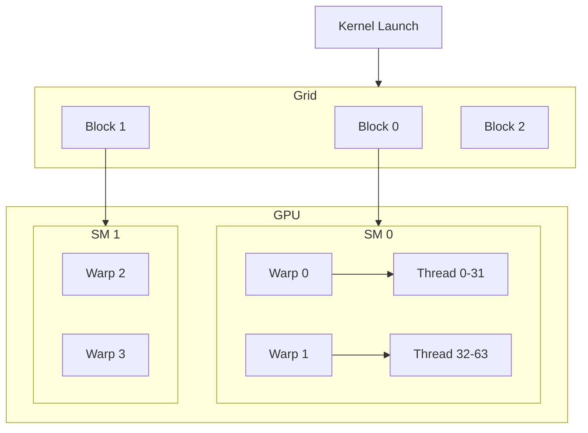

Thread → Warp (32) → Block → Grid → SM

</div>
</div>

---

# 2.1 GPU 内存层次结构

GPU 的内存层次比 CPU 更复杂，性能对访存模式极其敏感：

<div class="grid grid-cols-2 gap-6 mt-2">
<div>

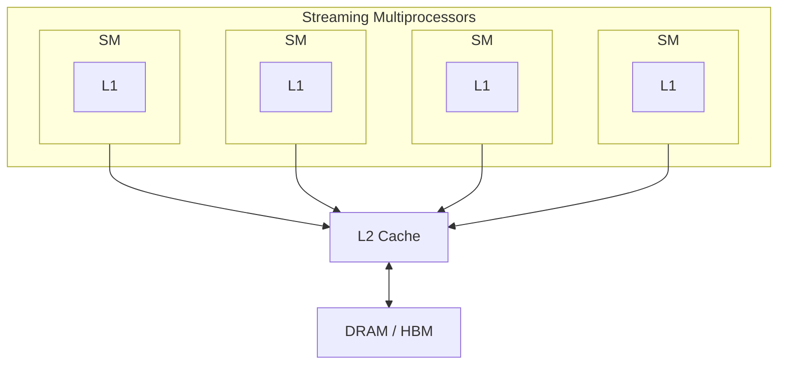

</div>
<div class="text-sm">

### 内存层次

| 层次 | 速度 | 容量 | 作用域 |
|-----|-----|-----|-------|
| 寄存器 | 最快 | KB级 | 单线程 |
| 共享内存 | 很快 | 48-164KB | Block 内 |
| L1 Cache | 快 | 128KB | SM 内 |
| L2 Cache | 中 | 数 MB | 全局 |
| DRAM/HBM | 慢 | 数十 GB | 全局 |

### 性能影响

- **访存合并**：连续访问合并为一次事务
- **Bank Conflict**：共享内存冲突导致串行化
- **Cache 命中率**：决定实际访存延迟

</div>
</div>

---

# 2.1 GPU 性能敏感点详解

<div class="grid grid-cols-2 gap-8 mt-2">
<div>

### Warp Divergence (线程束分化)

```c
if (threadIdx.x < 16) {
    // 路径 A: 16 个线程执行
} else {
    // 路径 B: 另外 16 个线程执行
}
// 两条路径串行执行，性能下降 50%+
```

**原因**：Warp 内所有线程必须执行相同指令，不同分支只能串行

### 访存合并失败

```c
// 合并访问: 32 线程 → 1 次事务
data[threadIdx.x]

// 跳跃访问: 32 线程 → 32 次事务
data[threadIdx.x * stride]
```

</div>
<div>

### Bank Conflict

共享内存分为 32 个 bank，每个 bank 每周期只能服务一个请求

```c
// 无冲突: 每线程访问不同 bank
shared[threadIdx.x]

// 冲突: 多线程访问同一 bank
shared[threadIdx.x * 2]  // bank 0, 2, 4... 冲突
```

### Occupancy (占用率)

SM 上能同时运行的 Warp 数量

- 寄存器用太多 → Warp 数减少
- 共享内存用太多 → Block 数减少
- Occupancy 低 → 无法隐藏访存延迟

</div>
</div>

---

# 2.2 同步执行：CPU 端工具能看到什么

在同步模式下，CUDA API 调用会阻塞，CPU 和 GPU 时间线紧密耦合：

<div class="text-sm mt-2">

```text
CPU 时间线 (传统工具看到的):
─────────────────────────────────────────────────────────────────────────
 cudaMalloc()    cudaMemcpy()         cudaLaunchKernel()  cudaDeviceSync()
──────●──────────●───────────────────●──────────────────●─────────────────
   ~1μs 等待      200μs 等待          立即返回           115μs 等待
   (阻塞)        (H→D 传输)                             (内核完成)

GPU 时间线 (实际执行，包含隐藏阶段):
─────────────────────────────────────────────────────────────────────────
      ◄─分配─►◄────H→D DMA────►◄──启动──►◄──内核执行──►◄─清理─►
      │ ~1μs  │     200μs      │   5μs   │    100μs    │ ~10μs │
──────┴───────┴────────────────┴─────────┴─────────────┴───────┴─────────
                                         (SM 忙碌)           (SM 空闲)
```

</div>

<div class="mt-4 text-sm">

**CPU 端可以看到**：cudaMemcpy() 需要 200μs，cudaDeviceSynchronize() 需要 115μs
→ 开发人员可以快速识别：数据传输占主导 (PCIe 瓶颈)，可考虑固定内存或更大批量

</div>

---

# 2.2 同步执行的局限：无法区分内部阶段

当开发人员问"内核同步需要 115μs，为什么内核这么慢？"时，CPU 端工具遇到根本性障碍：

<div class="grid grid-cols-2 gap-6 mt-4 text-sm">
<div>

### 115μs 是不透明的聚合

混合了多个隐藏的 GPU 端阶段：
- **内核启动开销**：~5μs 在 SM 上调度工作
- **实际内核执行**：~100μs 计算
- **清理**：~10μs 排空管道和释放资源

### CPU 端工具无法区分

即使完美计时同步 API 调用，也无法确定性能差是因为：

</div>
<div>

1. **过度启动开销**：太多小 kernel 启动
2. **计算低效**：由于分化只有 30% 的线程束活动
3. **内存访问模式**：未合并的全局内存加载导致停滞
4. **SM 利用不足**：只有 50% 的 SM 处于忙碌

**需要从 GPU 内部获得**：
- 线程束级执行信息
- 内存事务统计
- 每线程行为可见性

</div>
</div>

---

# 2.2 异步执行：信息完全丢失

在 GPU 使用中，几乎都采用异步执行模式，CPU 侧完全无法观测 GPU 内部时间线：

<div class="grid grid-cols-2 gap-6 mt-4 text-sm">
<div>

### 异步模式（信息丢失）

```text
CPU: LaunchAsync → LaunchAsync → Sync
         1μs            1μs      455μs
```

所有时间折叠到最后的 Sync 点

### 真实场景几乎都是异步

- `cudaMemcpyAsync` + 多 stream 做传输和计算重叠
- 持久 kernel 避免频繁 launch
- 框架（vLLM、TensorRT）统一组织 pipeline

</div>
<div>

### CPU 端只能看到

- 一系列几乎瞬间返回的 API 调用
- 若干 Sync 聚合了排队与执行时间

**无法区分**：
- 排队时间 vs GPU 实际执行时间
- 哪个 kernel 慢
- 内存传输是否与计算重叠

### 需要 GPU 内部的可编程视角

理解 kernel 执行期间发生了什么，而不仅仅是它何时开始和结束

</div>
</div>

---

# 2.3 现有 GPU 观测工具的局限

<div class="grid grid-cols-2 gap-8 mt-4">
<div>

### CPU-GPU 边界跟踪工具

通过拦截 CUDA/ROCm 用户态库或驱动层插入探针

**能观测**
- 进程何时调用 `cudaLaunchKernel` 等 API
- API 调用耗时、传输数据量

**不能观测**
- GPU 视为整体设备
- 无法深入 kernel 内部执行细节

</div>
<div>

### 供应商特定的 GPU Profiler

NVIDIA: CUPTI、Nsight Compute、NVBit

**优势**
- 可在 GPU 中插桩
- 获取 warp 级甚至指令级数据

**局限**
- 与 eBPF 生态独立，数据管道不统一
- 与通用监控平台集成成本高
- 细粒度模式开销大 (15-45%)
- 不适合长期部署在生产环境

</div>
</div>

<div class="mt-4 text-center bg-blue-50 dark:bg-blue-900/30 py-3 rounded">
<b>空白地带</b>：需要既有设备端细节，又与 eBPF 体系统一的方案
</div>

---
layout: center
class: text-center
---

# 三、将 eBPF 的可编程能力扩展到 GPU

<div class="text-4xl font-bold mt-8 mb-8 bg-gradient-to-r from-emerald-400 to-cyan-400 bg-clip-text text-transparent">
不仅是可编程观测，也是性能扩展与调度控制
</div>

<div class="text-xl opacity-70 max-w-2xl mx-auto">
不额外为 GPU 再造一套独立的 profiling 框架，而是统一的可编程平面
</div>

<div class="mt-12 flex justify-center gap-8 text-sm opacity-60">
  <div class="flex items-center gap-2"><div class="w-3 h-3 rounded-full bg-emerald-500"></div> 统一工具链</div>
  <div class="flex items-center gap-2"><div class="w-3 h-3 rounded-full bg-cyan-500"></div> 低开销</div>
  <div class="flex items-center gap-2"><div class="w-3 h-3 rounded-full bg-blue-500"></div> 生产可用</div>
  <div class="flex items-center gap-2"><div class="w-3 h-3 rounded-full bg-purple-500"></div> 调度与预取</div>
</div>

---

# 设计原则

<div class="grid grid-cols-2 gap-12 mt-8">
<div>

### 不是

- 再造一套独立的 GPU profiling 框架
- 与 CPU 侧工具各玩各的
- 仅仅是另一个 GPU profiler

</div>
<div>

### 而是

- GPU 作为 eBPF 的**原生运行场所**
- 与 CPU、内核在**编程模型上保持一致**
- 共享同一套**控制面和数据面**
- 框架与具体 GPU 厂商**解耦**

</div>
</div>

---

# 期望达到的能力

<div class="mt-6">

| 维度 | CPU 侧 eBPF | GPU 侧 eBPF (目标) |
|-----|-------------|-------------------|
| Probe 类型 | 系统调用挂 kprobe | kernel 入口/退出/barrier/load/store 挂类似 probe |
| 程序描述 | eBPF 程序 | 同样的 eBPF 程序，JIT 为 PTX/SPIR-V |
| 数据聚合 | map 在内核态聚合 | GPU 端 map 聚合，必要时回流 host |
| 统一分析 | 与其他 eBPF 数据统一 | 与 CPU 侧 eBPF 数据统一分析 |

</div>

<div class="mt-8">

### 框架设计原则

- 尽量与具体 GPU 厂商解耦
- 只依赖底层可用的设备 ISA target
- 贴近 bcc / libbpf 的使用习惯，降低迁移成本

</div>

---
layout: center
class: text-center
---

# 四、bpftime 原理与实现

<div class="text-xl mt-4 opacity-70">
透明插桩、eBPF 到 PTX 编译、GPU Map 与 Helper、L2 预取、CLC 调度
</div>

---

# 4.1 整体架构

<div class="grid grid-cols-2 gap-6 mt-2">
<div>

从架构上看，bpftime for GPU 主要解决三件事：

**1. eBPF → PTX**：把 eBPF 程序变成 GPU 能跑的代码

**2. 透明插桩**：在不改业务代码的前提下，把 probe 代码"缝"到已有 kernel 里

**3. 统一数据面**：让 GPU 设备端的 eBPF 与 CPU 端的 eBPF 共享同一套控制面和数据面

</div>
<div>

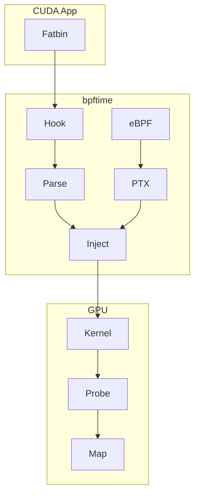

</div>
</div>

---

# bpftime 用户态 eBPF 运行时架构


<div class="grid grid-cols-3 gap-4 mt-4 text-xs">
  <div class="p-2 rounded bg-blue-500/10 border border-blue-500/20">
    <strong>eBPF 工具链</strong>：clang/bpftool 编译，libbpf 加载
  </div>
  <div class="p-2 rounded bg-emerald-500/10 border border-emerald-500/20">
    <strong>CPU Agent</strong>：JIT → x86/ARM，Frida uprobe
  </div>
  <div class="p-2 rounded bg-purple-500/10 border border-purple-500/20">
    <strong>GPU Agent</strong>：JIT → PTX，fatbin hook 注入
  </div>
</div>

<div class="text-xs mt-2 opacity-70 text-center">
图片来源: 尹瑞星 - GPU Profiling: Extending eBPF to GPUs
</div>

---

# 4.2 透明插桩

<div class="grid grid-cols-2 gap-6 mt-2 text-sm">
<div>

### fatbin 是什么？

CUDA 的二进制打包格式，包含：
- **PTX**：NVIDIA 的虚拟汇编语言，可读文本
- **SASS**：特定 GPU 架构的机器码

### 为什么 Hook fatbin？

- PTX 是**可读的文本格式**，可运行时修改
- 无需修改源代码或重新编译应用
- 通过 `LD_PRELOAD` 透明注入

</div>
<div>

### bpftime 的 Hook 点

| Hook 函数 | 时机 | 作用 |
|----------|-----|-----|
| `__cudaRegisterFatBinary` | 应用启动 | 截获 fatbin |
| `__cudaRegisterFunction` | kernel 注册 | 建立名称映射 |
| `cudaLaunchKernel` | kernel 启动 | 运行修改版本 |

### 工作流程

1. 应用启动时拦截 fatbin 注册
2. 解析 fatbin，提取 PTX
3. 将 eBPF probe 编译为 PTX 并注入
4. 重新打包并替换原始 fatbin

</div>
</div>

---

# eBPF → PTX 编译原理

<div class="text-sm mb-2">
核心思想：eBPF 和 CUDA 都经过 LLVM IR，可以共享同一个中间表示进行转换
</div>

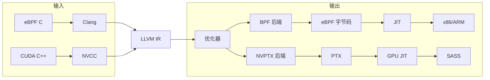

<div class="mt-2 text-sm">

**关键洞察**：LLVM IR 是与目标无关的中间表示。eBPF 和 GPU 都是 LLVM 支持的 target，因此可以通过 LLVM IR 作为"桥梁"，将 eBPF 程序编译为 GPU 可执行的 PTX 代码。

</div>

---

# llvmbpf：eBPF 到多目标的编译

<div class="grid grid-cols-2 gap-6 text-sm">
<div>

### 编译流程

```text
eBPF 字节码
    ↓ (反汇编)
eBPF 指令序列
    ↓ (llvmbpf lift)
LLVM IR
    ↓ (NVPTX backend)
PTX 代码
    ↓ (nvcc/ptxas)
GPU 可执行
```

### 核心价值

**同一份 eBPF 程序可以在 CPU 和 GPU 上运行**

</div>
<div>

### 关键转换

| eBPF 概念 | PTX 对应 |
|----------|---------|
| r0-r10 寄存器 | PTX 虚拟寄存器 |
| BPF_CALL helper | PTX 函数调用 |
| 内存访问 | ld.global / st.global |
| 算术运算 | add / mul / div 等 |

### 与 bpftime 的集成

1. bpftime 加载 eBPF 程序
2. llvmbpf 将其编译为 PTX
3. PTX 被注入到目标 CUDA kernel
4. GPU 执行插桩后的 kernel

</div>
</div>

---

# PTX 注入与修改示例

<div class="grid grid-cols-2 gap-6 text-sm">
<div>

### 原始 kernel

```text
.entry _Z9myKernelPf(...)
{
    ld.global.f32 %f1, [%rd1];
    mul.f32 %f2, %f1, %f3;
    st.global.f32 [%rd2], %f2;
    ret;
}
```

### 插桩位置

| 位置 | 类型 | 用途 |
|-----|-----|-----|
| 函数入口 | uprobe | 调用计数、参数采样 |
| ret 指令前 | uretprobe | 耗时统计 |
| load/store 前 | 访存跟踪 | 内存访问分析 |

</div>
<div>

### 注入后

```text
.entry _Z9myKernelPf(...)
{
    // uprobe: 函数入口
    call.uni __uprobe_func_myKernel;
    
    ld.global.f32 %f1, [%rd1];
    mul.f32 %f2, %f1, %f3;
    st.global.f32 [%rd2], %f2;
    
    // uretprobe: 函数退出
    call.uni __uretprobe_func_myKernel;
    ret;
}
```

修改完成后，通过 hook `cudaLaunchKernel` 确保运行修改版本

</div>
</div>

---

# GPU 特性适配：Helper 与 PTX 映射

<div class="grid grid-cols-2 gap-8 mt-4 text-sm">
<div>

### 线程索引获取

```c
// eBPF Helper
u32 idx = bpf_get_thread_idx();
```

```text
// 生成的 PTX
mov.u32 %r1, %tid.x;   // X 维度
mov.u32 %r2, %tid.y;   // Y 维度
mov.u32 %r3, %tid.z;   // Z 维度
mov.u32 %r4, %ctaid.x; // Block X
```

**用途**：识别当前是哪个线程在执行，用于 per-thread 统计

</div>
<div>

### 全局计时器

```c
// eBPF Helper
u64 ts = bpf_get_globaltimer();
```

```text
// 生成的 PTX
mov.u64 %rd1, %globaltimer;
```

**用途**：
- 纳秒级精度的时间戳
- 测量 kernel 执行时间
- 计算线程完成时间分布
- 跨 CPU-GPU 时间线对齐

</div>
</div>

---

# PTX Pass：可配置的插桩管线

<div class="grid grid-cols-2 gap-6 text-sm">
<div>

### 管线处理流程

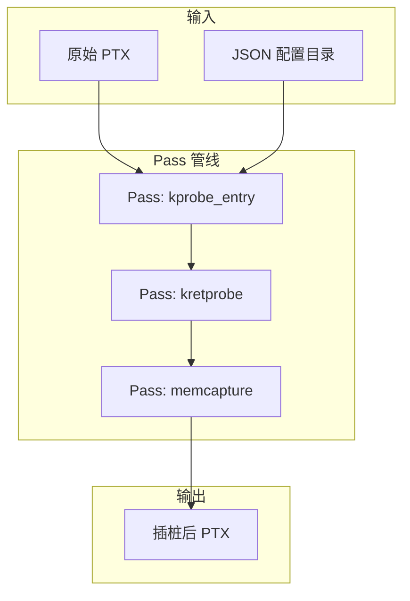

</div>
<div>

### 内置 Pass 类型

| Pass | 功能 |
|------|------|
| `kprobe_entry` | 函数入口插桩 |
| `kretprobe` | 函数返回插桩 |
| `memcapture` | 内存访问捕获 |

### 架构优势

| 特性 | 说明 |
|------|------|
| **可配置** | JSON 控制 Pass 顺序和参数 |
| **可扩展** | 新增 Pass 不影响现有代码 |
| **可调试** | 每个 Pass 可独立测试运行 |
| **可组合** | 按需选择 Pass 组合 |

</div>
</div>

---

# 4.3 GPU 上的 Map 与 Helper

<div class="grid grid-cols-2 gap-8 mt-4">
<div>

### 为什么需要设备本地 Map？

如果 GPU 上的 probe 每次访问 map 时都通过 PCIe 访问 host 内存：

- PCIe 跨域访问延迟高达数十微秒
- 大量线程并发访问导致严重的锁竞争
- kernel 整体性能显著下降

> GPU 本地访问 ~100ns，跨 PCIe ~40μs，相差 **400 倍**

</div>
<div>

### GPU Map 类型设计

| Map 类型 | 适用场景 | 示例工具 |
|---------|---------|---------|
| **Per-thread Array** | 每线程的计数/指标 | threadhist |
| **GPU Ringbuf** | 向 host 上报事件 | kernelretsnoop |
| **共享 Map** | 低频全局配置 | 配置下发 |

### GPU 端 Helper

```c
u32 idx = bpf_get_thread_idx();
u64 ts = bpf_get_globaltimer();
bpf_map_update_elem(&my_map, &key, &value, BPF_ANY);
```

</div>
</div>

---

# 性能优化与开销对比

<div class="grid grid-cols-2 gap-6 text-sm">
<div>

### Kernel Launch 优化

将 `cudaHostRegister` 从每次 attach 改为**一次性注册整个共享内存段**

| API | 优化前 | 优化后 |
|-----|-------|-------|
| cudaHostRegister | **448ms** (47.2%) | - |
| cuLaunchKernel | 269ms (28.3%) | **170ms** (30.5%) |

**关键发现**：bpftime 的 `cuLaunchKernel` 平均耗时 **5.6μs**，比原生 `cudaLaunchKernel` 的 **11.6μs** 更快！

原因：bpftime 绕过 Runtime 直接调用 Driver API

</div>
<div>

### 与其他工具对比

| 场景 | bpftime | NVBit | CUPTI |
|-----|---------|-------|-------|
| 典型开销 | **2-3%** | 30-45% | 15-25% |
| ResNet 推理 | ~原生 | - | 15-25% |

### 可常驻生产环境

传统 GPU profiler 开销大，只能在调试时使用

bpftime 开销低，可以：
- 持续监控生产环境
- 捕获偶发性能问题
- 与 CPU 侧 eBPF 统一部署

</div>
</div>

---

# 4.4 GPU L2 预取能力 (实验性)

<div class="grid grid-cols-2 gap-6 text-sm">
<div>

### 问题场景

UVM (Unified Virtual Memory) 场景下：
- CPU 和 GPU 共享内存页
- 缺页中断导致性能下降
- 传统优化需要修改源代码

### 新增能力

通过 eBPF 注入预取指令：

```c
// 新增 Helper (ID: 509)
bpf_prefetch_l2(addr);
```

对应 PTX：`prefetch.global.L2 [%0];`

</div>
<div>

### 应用价值

| 能力 | 说明 |
|-----|-----|
| **运行时缓存管理** | eBPF 主动干预硬件 Cache |
| **非侵入式优化** | 无需修改/重编译源代码 |
| **UVM 动态优化** | 提前触发缺页，减少停顿 |

### 意义

bpftime 不仅是观测工具，开始具备**通过动态注入指令来"加速"GPU 程序**的能力

</div>
</div>

<div class="mt-2 text-xs opacity-70">
PR: <a href="https://github.com/eunomia-bpf/bpftime/pull/526" target="_blank">github.com/eunomia-bpf/bpftime/pull/526</a>
</div>

---

# 4.4 GPU L2 预取：工作原理与应用

<div class="grid grid-cols-2 gap-6 text-sm">
<div>

### 工作原理

1. **Uprobe**: 挂载在宿主程序函数上，截获配置信息
2. **GPU Kprobe**: 挂载在 CUDA kernel 上
3. **预取逻辑**: 计算即将访问的地址，提前预取

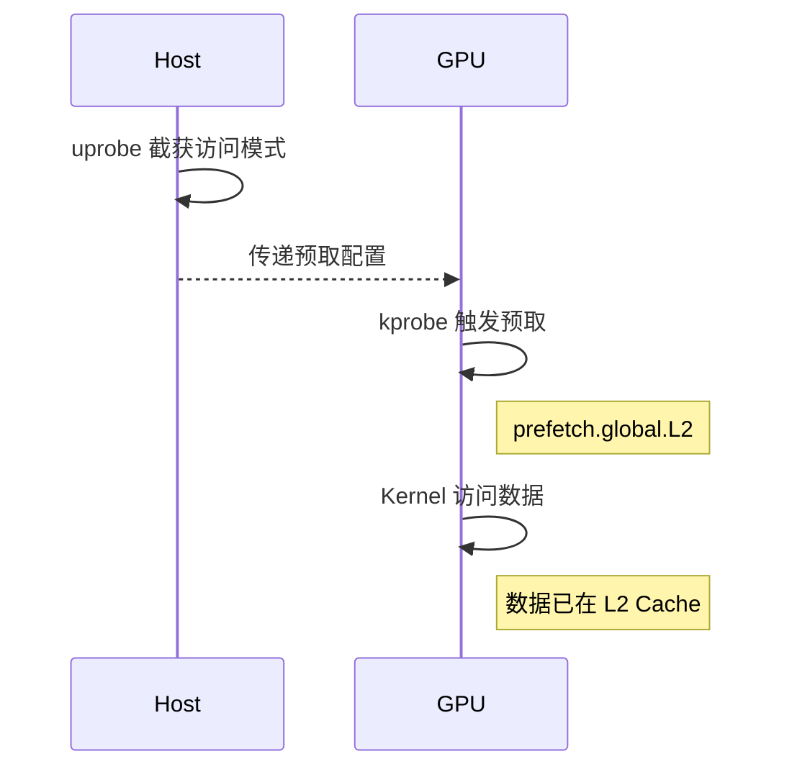

</div>
<div>

### 潜在应用场景

| 场景 | 说明 |
|-----|-----|
| **MoE 模型优化** | 根据激活的专家提前预取权重 |
| **稀疏访问优化** | 预测访问模式，提前加载 |
| **闭源应用加速** | 无需源码即可注入优化 |

### 与传统方法对比

| 方法 | 侵入性 | 灵活性 |
|-----|-------|-------|
| 修改源码 | 高 | 低 |
| cudaMemPrefetchAsync | 中 | 中 |
| **bpftime 预取** | **无** | **高** |

</div>
</div>

---

# 4.4 GPU L2 预取：性能对比

<div class="grid grid-cols-2 gap-6 text-sm">
<div>

### UVM 内存超额订阅测试

测试配置：
- GPU 显存: 22905 MB
- 工作集: 34358 MB (1.5x 超额订阅)
- Kernel: seq_stream
- 步长: 4096 bytes (页级别)

### 性能对比

| 指标 | 无 bpftime | 有 bpftime 预取 |
|-----|-----------|----------------|
| 中位耗时 | 107079 ms | **70097 ms** |
| 带宽 | 0.34 GB/s | **0.51 GB/s** |

</div>
<div>

### 性能提升

<div class="mt-4 p-4 rounded-lg bg-gradient-to-r from-emerald-500/20 to-green-500/20 border border-emerald-500/30 text-center">
  <div class="text-3xl font-bold text-emerald-400">~35%</div>
  <div class="text-sm opacity-70">耗时减少</div>
</div>

<div class="mt-4 p-4 rounded-lg bg-gradient-to-r from-cyan-500/20 to-blue-500/20 border border-cyan-500/30 text-center">
  <div class="text-3xl font-bold text-cyan-400">~52%</div>
  <div class="text-sm opacity-70">带宽提升</div>
</div>

### 原理

eBPF 预取提前触发 UVM 缺页，使数据在 kernel 访问前完成迁移

</div>
</div>

---

# 4.5 CLC + bpftime：GPU 内核级调度

<div class="grid grid-cols-2 gap-6 text-sm">
<div>

### 什么是 CLC？

CLC (Cooperative Launch Control) 是一种 GPU 内核级调度框架：

- 使用 **nvJitLink** 在运行时链接 PTX
- 实现 **Block 级 work-stealing** 调度
- 通过 **Policy** 抽象控制调度策略

### 与 bpftime 的结合

**三层架构**：
- **bpftime 控制面**：hook `cudaLaunchKernel`，从 eBPF Map 读取策略，决定是否替换成 CLC 版本
- **CLC 框架层**：提供 Policy 接口，nvJitLink 链接 PTX
- **GPU 数据面**：Wrapper Kernel 做 work-stealing，调用 user kernel

</div>
<div>

### 架构示意

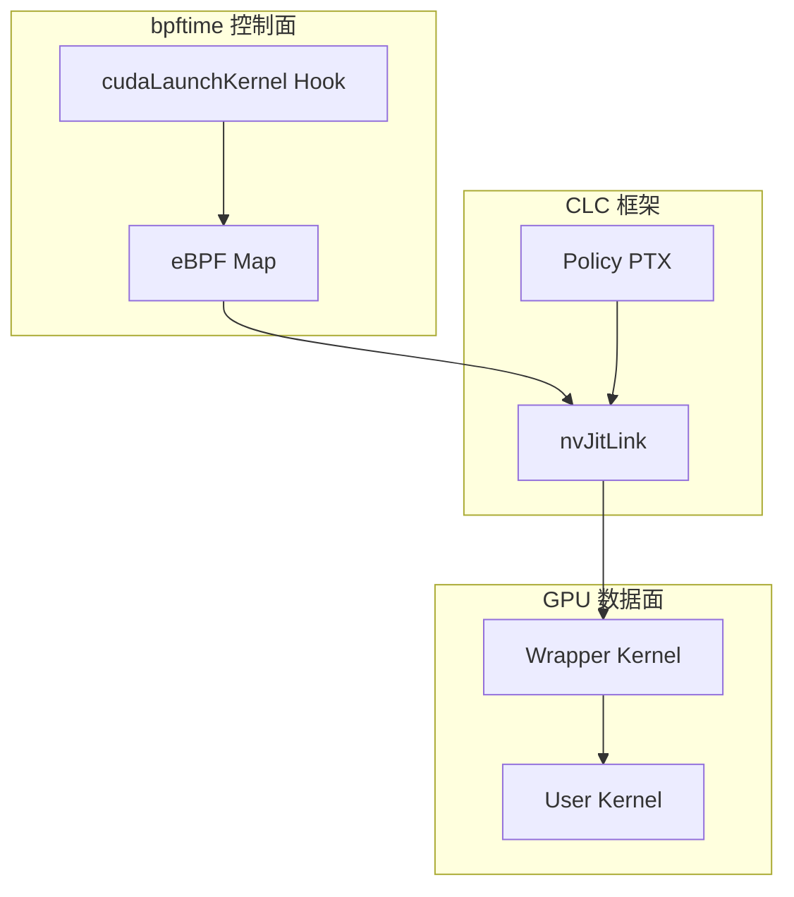

</div>
</div>

---

# 4.5 CLC + bpftime：应用场景

<div class="grid grid-cols-2 gap-6 text-sm">
<div>

### 典型应用场景

| 场景 | 说明 |
|-----|-----|
| **多租户调度** | 不同租户使用不同 Policy |
| **运行时优化** | 根据负载动态调整策略 |
| **LLM 推理** | 已验证 Qwen3 集成 |
| **稀疏计算** | MaxStealsPolicy 限制执行次数 |

### 内置 Policy

- **GreedyPolicy**：始终执行 (基线)
- **MaxStealsPolicy**：限制最大执行次数
- 可自定义扩展其他 Policy

</div>
<div>

### 工作流程

1. bpftime hook `cudaLaunchKernel` 截获原始 kernel
2. 从 eBPF Map 读取当前策略配置
3. 决定是否替换成 CLC 版本
4. nvJitLink 运行时链接 User PTX + Policy PTX
5. GPU 执行带策略的 Wrapper Kernel

### LLM 推理验证 (Qwen3)

| 版本 | TTFT | Tokens/sec |
|-----|------|------------|
| 原始 | 0.294s | 54.65 |
| GreedyPolicy | 0.348s | 49.31 |
| MaxStealsPolicy | 0.347s | 49.08 |

~18% 开销来自 nvJitLink 链接和 Policy 评估

</div>
</div>

---

# 4.5 CLC + bpftime：核心价值

<div class="grid grid-cols-2 gap-6 text-sm">
<div>

### 闭环优化

```text
观测 (bpftime) → 分析 (eBPF) → 决策 (Map) → 执行 (CLC)
      ↑                                        ↓
      └────────── 反馈指标 ──────────────────────┘
```

### 与传统方法对比

| 能力 | 传统 Profiler | bpftime | bpftime + CLC |
|-----|--------------|---------|---------------|
| 观测 | 有 | 有 | 有 |
| 低开销 | 否 | 是 | 是 |
| 运行时调度 | 否 | 否 | **是** |
| 策略注入 | 否 | 部分 | **是** |
| 无需源码 | 否 | 是 | 是 |

</div>
<div>

### 核心价值

<div class="p-4 rounded-lg bg-gradient-to-r from-purple-500/20 to-pink-500/20 border border-purple-500/30 text-center">
从 <strong>被动观测</strong> 迈向 <strong>主动调度</strong>
</div>

### 潜在优化方向

- 减少 Policy 评估开销
- 实现更细粒度的 work-stealing
- 支持跨 kernel 的调度策略
- 观测数据驱动的自适应调度

### 意义

bpftime 不仅是观测工具，开始具备**通过动态注入来控制 GPU 调度行为**的能力

</div>
</div>

<div class="mt-2 text-xs opacity-70">
参考: <a href="https://github.com/eunomia-bpf/co-processor-demo/tree/main/scheduler" target="_blank">github.com/eunomia-bpf/co-processor-demo/scheduler</a>
</div>

---
layout: center
class: text-center
---

# 五、GPU 观测工具实践

<div class="mt-6 text-lg opacity-60">
kernelretsnoop / threadhist / launchlate / mem_trace / SM mapping
</div>

---

# 5.1 kernelretsnoop：线程完成时间分布

<div class="grid grid-cols-2 gap-6 text-sm">
<div>

### 问题场景

传统 profiler 只给 kernel **总耗时**，无法定位是哪些线程慢

### 工作原理

1. 在 CUDA kernel 退出点挂 GPU kretprobe
2. 每个线程记录：`bpf_get_thread_idx()` + `bpf_get_globaltimer()`
3. 写入 GPU ringbuf，host 消费聚合

### 典型输出

```text
Thread (0, 0, 0) timestamp: ...023136
Thread (1, 0, 0) timestamp: ...023140
...
Thread (31, 0, 0) timestamp: ...023890  ← 晚 750ns
```

</div>
<div>

### 洞察

线程 31 处理边界条件，触发 warp divergence

### 可诊断的问题

- **Warp Divergence**：某些线程执行不同分支
- **内存访问模式**：每 8 个线程慢 → bank conflict
- **边界条件**：边缘线程额外处理

### 使用方式

```bash
# Terminal 1: 启动工具
bpftime load ./kernelretsnoop
# Terminal 2: 运行 CUDA 应用
bpftime start ./your_cuda_app
```

</div>
</div>

---

# 5.2 threadhist：线程执行次数直方图

<div class="grid grid-cols-2 gap-6 text-sm">
<div>

### 问题场景

Grid-stride loop 或稀疏数据导致线程负载不均

### 工作原理

- per-thread array map 计数
- kernel 退出时 `*cnt += 1`
- host 定期导出直方图

### 典型输出

```text
Thread 0: 210432
Thread 1: 210432
Thread 2: 210432
Thread 3: 210432
Thread 4: 158304  ← 只有 75%
```

线程 4 提前退出，其他线程等待

</div>
<div>

### 可诊断的问题

| 模式 | 原因 |
|-----|-----|
| 最后一个线程少 | Grid-stride loop 边界 |
| 某线程为 0 | launch 配置错误 |
| 分布不均 | 算法负载不均 |

### 应用场景

- 优化 thread block 配置
- 验证 grid-stride loop 实现
- 检测稀疏数据负载问题

</div>
</div>

---

# 5.3 launchlate：Launch 延迟分析

<div class="grid grid-cols-2 gap-6 text-sm">
<div>

### 问题场景

kernel 执行 100μs，但应用延迟 50ms

### 典型输出

```text
Launch Latency Distribution:
100ns-1us  : 45   |********
1-10us     : 234  |**********************
10-100us   : 167  |****************
100us-1ms  : 89   |********
1-10ms     : 12   |**
```

</div>
<div>

### 洞察

- 大量 10-100μs → 正常调度开销
- 1-10ms spike → context switch / PCIe 拥塞
- 解决：CUDA Graph / kernel fusion

### 使用方式

```bash
# Terminal 1: 启动工具
bpftime load ./launchlate
# Terminal 2: 运行 CUDA 应用
bpftime start ./your_cuda_app
```

</div>
</div>

---

# 5.3 launchlate：工作原理

<div class="grid grid-cols-2 gap-8">
<div>

### 跨 CPU-GPU 时间测量

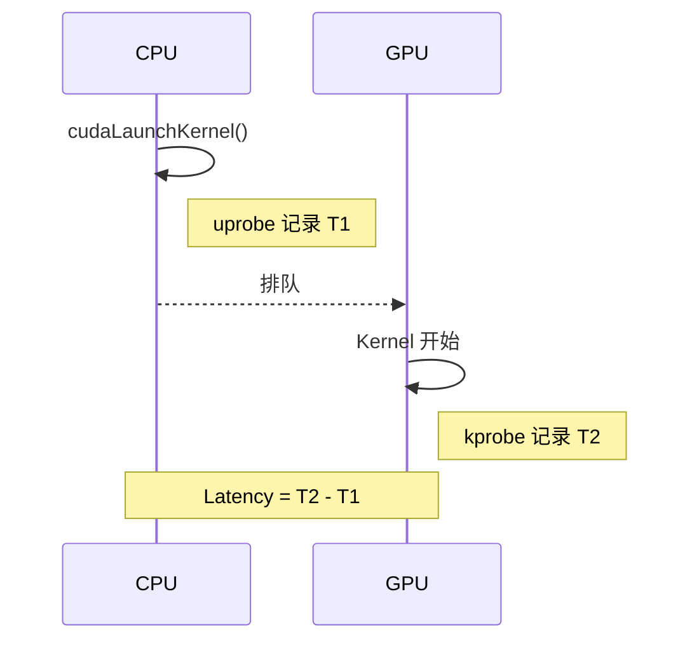

</div>
<div class="text-sm">

### 实现要点

1. **CPU 侧 uprobe**：挂载在 `cudaLaunchKernel`，记录调用时间 T1

2. **GPU 侧 kprobe**：挂载在目标 kernel 入口，记录开始执行时间 T2

3. **时间对齐**：两边时间通过校准对齐到统一基准

4. **延迟计算**：Launch Latency = T2 - T1

### 可诊断的问题

| 延迟模式 | 可能原因 |
|---------|---------|
| 持续 >100μs | 小 kernel 启动开销过大 |
| 偶发 >1ms | 上下文切换/PCIe 拥塞 |
| 分布不均 | 多 stream 调度竞争 |

</div>
</div>

---

# 5.4 mem_trace：GPU 显存访问跟踪

<div class="grid grid-cols-2 gap-6 text-sm">
<div>

### 问题场景

需要了解 CUDA kernel 的 **GPU 显存 (Global Memory)** 访问模式：
- 访问是否合并 (Coalesced Access)
- 是否有频繁的全局显存访问
- 访问模式是否导致 L2 cache miss

### 工作原理

1. 在 GPU kernel 的 `ld.global` / `st.global` 指令前插入 probe
2. 记录显存访问地址、线程索引、时间戳
3. 统计每个进程的显存访问次数

</div>
<div>

### 典型输出

```text
16:30:45
    pid=12345    mem_traces: 120
```

显示进程 12345 的 GPU kernel 执行了 120 次显存访问

### 使用方式

```bash
# Terminal 1
bpftime load ./mem_trace
# Terminal 2
bpftime start ./vec_add
```

</div>
</div>

---

# 5.5 SM/Warp/Lane 硬件映射 (实验性)

<div class="grid grid-cols-2 gap-6 text-sm">
<div>

### 问题场景

传统 profiler 只能获取逻辑上的 CUDA 线程索引，无法回答：
- 我的线程块到底跑在哪个 SM 上？
- Warp 在 SM 内部是如何分布的？
- 是否存在 SM 负载不均衡？

### 新增能力

通过 PTX 特殊寄存器获取硬件拓扑信息：

```c
// 新增 Helper
u32 sm_id   = bpf_get_sm_id();
u32 warp_id = bpf_get_warp_id();
u32 lane_id = bpf_get_lane_id();
```

对应 PTX：`%smid`, `%warpid`, `%laneid`

</div>
<div>

### GPU 负载均衡分析

通过统计 SM ID 分布，可以分析：

| 问题 | 诊断方式 |
|-----|---------|
| **负载不均** | 某些 SM 线程数远高于其他 |
| **调度验证** | 验证持久化内核是否独占 SM |
| **Warp 占用率** | 分析 SM 内 Warp 分布 |

### 调试价值

能够回答"我的线程块到底跑在哪块 SM 上？"：
- 调试复杂的并发竞争
- 分析性能抖动根因
- 验证 GPU 调度器行为

</div>
</div>

<div class="mt-2 text-xs opacity-70">
PR: <a href="https://github.com/eunomia-bpf/bpftime/pull/523" target="_blank">github.com/eunomia-bpf/bpftime/pull/523</a>
</div>

---

# 5.5 SM/Warp/Lane 映射：典型输出

<div class="grid grid-cols-5 gap-4">
<div class="col-span-2 text-sm">

### 输出解读

**SM Utilization Histogram**
- 展示每个 SM 上运行的线程数
- 可直观看出 SM 间负载是否均衡

**Load Balance Score: 43.9%**
- 100% 表示完美均衡分布
- 43.9% 说明 SM 间负载严重不均

**Warp Distribution per SM**
- 每个 SM 内的 Warp 分布情况
- 用于分析 Warp 占用率

**Thread-to-Hardware Mapping**
- Block/Thread 到 SM/Warp/Lane 的映射
- 可追踪特定线程的物理执行位置

<div class="mt-2 p-2 bg-yellow-50 dark:bg-yellow-900/30 rounded text-xs text-center">
从"逻辑追踪"迈向"物理/硬件感知追踪"
</div>

</div>
<div class="col-span-3">


</div>
</div>

---

# 5.6 真实工作负载验证：深度学习框架

<div class="grid grid-cols-2 gap-6 text-sm">
<div>

### PyTorch 支持

PyTorch 需要编译时包含 PTX 才能被 bpftime 插桩：

```bash
# 编译 PyTorch 时包含 PTX
TORCH_CUDA_ARCH_LIST=6.1+PTX uv pip install -e .
```

验证方式：

```bash
bpftime load ./threadhist
bpftime start python pytorch_test.py
```

可观测 PyTorch 内部 CUDA kernel (如 `torch.sort`) 的线程执行分布

</div>
<div>

### llama.cpp 支持

分析 LLM 推理时的 GPU kernel 执行模式：

```bash
bpftime load ./threadhist
bpftime start ./llama-cli -m model.gguf -p "Hello"
```

### 适用场景

- 分析 PyTorch 内部 kernel 的线程分布
- 追踪 LLM 推理时的 GPU 执行模式
- 验证深度学习框架的 GPU 调度行为

</div>
</div>

---

# 5.6 真实工作负载验证：高性能计算库

<div class="grid grid-cols-2 gap-6 text-sm">
<div>

### Faiss (向量检索) 支持

Faiss 是 Facebook 的向量检索库，GPU 版本可用于分析：

```bash
# 编译 Faiss GPU 版本
cmake -DFAISS_ENABLE_GPU=ON ...
# 分析
bpftime load ./threadhist
bpftime start ./demo_ivfpq_indexing_gpu
```

输出示例：所有 7 个线程执行次数相同 (236)，负载均衡良好

</div>
<div>

### CUTLASS (GEMM) 支持

CUTLASS 是 NVIDIA 的高性能 GEMM 库：

```bash
bpftime load ./cutlass_launch_counter
bpftime start ./cutlass_gemm --shape 4096x4096x4096
```

输出：`CUTLASS launches: 24`，验证大矩阵乘法插桩正常

### 适用场景

- 向量数据库的 GPU 性能分析
- 高性能矩阵运算的执行追踪
- 验证 HPC 库的 GPU 负载均衡

</div>
</div>

---

# 5.7 性能开销对比

<div class="grid grid-cols-2 gap-6 mt-2">
<div>

### 与其他工具对比

<div class="overflow-hidden rounded-lg border border-gray-200 dark:border-gray-700">
<table class="w-full text-sm">
<thead class="bg-gray-100 dark:bg-gray-800">
<tr><th class="p-2 text-left">场景</th><th class="p-2">bpftime</th><th class="p-2">NVBit</th><th class="p-2">CUPTI</th></tr>
</thead>
<tbody>
<tr class="border-t border-gray-200 dark:border-gray-700"><td class="p-2">典型开销</td><td class="p-2 text-center text-emerald-500 font-bold">2-3%</td><td class="p-2 text-center text-red-400">30-45%</td><td class="p-2 text-center text-yellow-400">15-25%</td></tr>
<tr class="border-t border-gray-200 dark:border-gray-700"><td class="p-2">ResNet 推理</td><td class="p-2 text-center text-emerald-500 font-bold">~原生</td><td class="p-2 text-center">-</td><td class="p-2 text-center text-yellow-400">15-25%</td></tr>
</tbody>
</table>
</div>

### 开销可控原因

- SIMT-aware verifier 避免 divergence
- 分层 map：热数据 GPU 本地
- 选择性插桩：只在关键点

</div>
<div>

### 可常驻生产环境

传统 GPU profiler 开销大，只能在调试时使用

bpftime 开销低，可以：
- 持续监控生产环境
- 捕获偶发性能问题
- 与 CPU 侧 eBPF 统一部署

<div class="mt-4 p-4 rounded-lg bg-gradient-to-r from-emerald-500/20 to-green-500/20 border border-emerald-500/30 text-center">
  <div class="text-2xl font-bold text-emerald-400">3-10x</div>
  <div class="text-sm opacity-70">快于 NVBit</div>
</div>

</div>
</div>

---
layout: center
class: text-center
---

# 六、统一观测与慢节点检测

<div class="text-xl mt-4 opacity-70 max-w-xl mx-auto">
仅观察 GPU 本身往往不足以解释真实问题
</div>

<div class="mt-8 flex justify-center gap-4">
  <div class="px-4 py-2 rounded-lg bg-gradient-to-r from-cyan-500/20 to-blue-500/20 border border-cyan-500/30">
    CPU + Kernel + GPU 全链路
  </div>
  <div class="px-4 py-2 rounded-lg bg-gradient-to-r from-orange-500/20 to-red-500/20 border border-orange-500/30">
    分布式训练慢节点定位
  </div>
</div>

---

# 6.1 全链路观测架构

<div class="grid grid-cols-5 gap-6 mt-2">
<div class="col-span-2">

### 多层次 probe 部署

| 层次 | 技术 | 观测内容 |
|-----|-----|---------|
| 用户态 | uprobes | PyTorch/vLLM API |
| 内核 | kprobes | IO、调度、UVM |
| GPU | 设备端 eBPF | kernel 内部 |

**统一数据面**：共享 map + 统一时间基准

</div>
<div class="col-span-3">

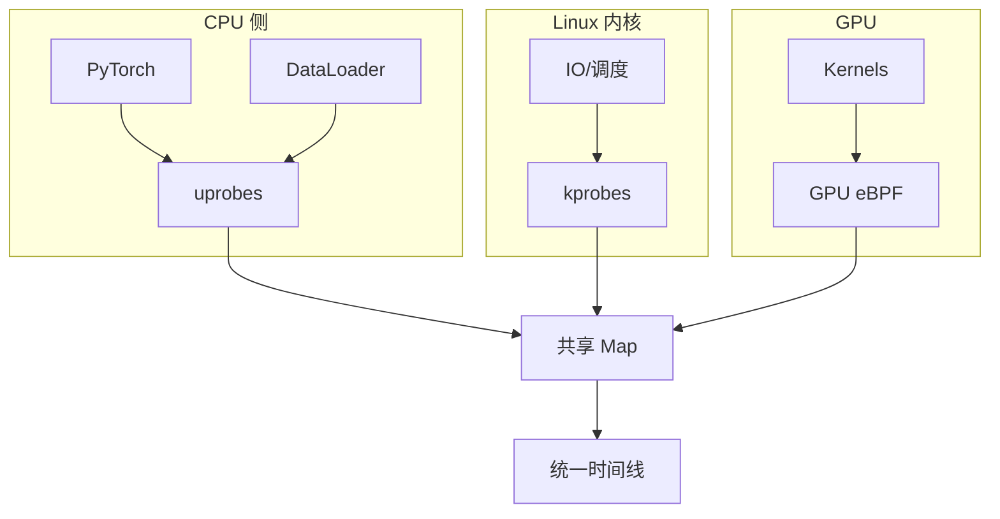

</div>
</div>

---

# 6.2 跨层关联分析

<div class="grid grid-cols-2 gap-6 text-sm">
<div>

### 统一时间线示例

```text
CPU 侧:
[0-50ms]   DataLoader 加载数据
[50-51ms]  cudaLaunchKernel
[51-200ms] cudaDeviceSynchronize

内核:
[60-80ms]  page fault (UVM 迁移)
[100-120ms] cgroup 内存限流

GPU 侧:
[55-80ms]  排队等待
[80-150ms] Kernel 执行
[100-130ms] warp stall
           ↑ 与 page fault 时间重叠!
```

</div>
<div>

### 关联分析能力

| 问题 | 传统方法 | bpftime |
|-----|---------|---------|
| GPU stall 原因 | 猜测 | 明确关联 page fault |
| 延迟来源 | 聚合指标 | 精确到 ms 级 |
| 跨层因果 | 无法确定 | 时间线对齐 |

### 可回答的问题

- page fault / cgroup 限流是否与 GPU stall 相关？
- DataLoader 慢是否导致 GPU 空闲？
- kernel 执行慢是计算还是访存问题？

<div class="mt-2 p-2 rounded bg-emerald-500/10 border border-emerald-500/20 text-xs">
<strong>关键</strong>：统一时间基准 + 共享 Map = 跨层因果分析
</div>

</div>
</div>

---

# 6.3 慢节点问题背景

<div class="grid grid-cols-2 gap-6 mt-2 text-sm">
<div>

### 分布式训练的同步机制

| 术语 | 含义 |
|-----|-----|
| **Rank** | 分布式训练中每个 GPU 进程的编号 (0, 1, 2...) |
| **All-Reduce** | 所有 rank 交换梯度并求和的集合通信操作 |
| **Barrier** | 同步点，所有 rank 必须到达后才能继续 |
| **NCCL** | NVIDIA 的 GPU 集合通信库 |

### 木桶效应

在 all-reduce/barrier 模式下：
- 所有 rank 必须等待最慢的那个完成
- **一个 rank 慢 = 全体等待**
- 整体 step time 由最慢 rank 决定

</div>
<div>

### 以前只能看到

- 某个 rank 的 step time 偶发性偏长
- 推断某次 all-reduce 中某个 rank 可疑
- **无法确定**问题在计算、通信还是主机侧

### 慢节点分类

| 类型 | 原因 |
|-----|-----|
| **计算慢** | GPU 算子执行延长 |
| **通信慢** | NCCL 通信耗时增加 |
| **主机慢** | CPU 瓶颈，算子下发慢 |

</div>
</div>

---

# 6.4 多层次观测部署

<div class="grid grid-cols-5 gap-4">
<div class="col-span-2 text-xs">

### GPU 内核层 (设备端 eBPF)

| 观测点 | 工具 | 数据 |
|-------|-----|-----|
| forward | kernelretsnoop | 耗时分布 |
| backward | threadhist | 负载均衡 |
| NCCL | launchlate | 通信延迟 |

### CPU 主机层 (uprobes/kprobes)

| 观测点 | 数据 |
|-------|-----|
| DataLoader | 加载耗时 |
| cudaLaunchKernel | 下发时间 |
| page fault | UVM 迁移 |
| cgroup | 限流事件 |

</div>
<div class="col-span-3">

### 跨节点聚合分析

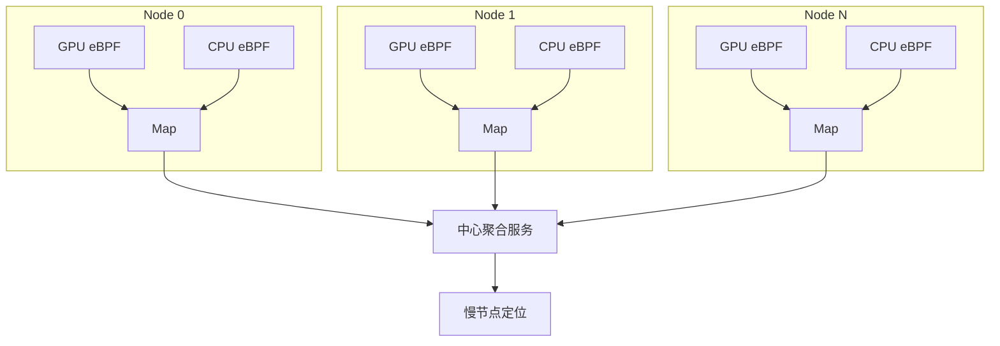

</div>
</div>

---

# 6.5 实战案例：现象描述

<div class="text-sm">

### 现象

- 分布式训练 step time 抖动
- 吞吐偏低，但粗粒度监控显示 GPU 利用率**正常**
- 难以定位是哪个节点、哪个阶段导致

### 接入 bpftime 后采集的数据

<div class="grid grid-cols-2 gap-6 mt-4">
<div>

**GPU 侧 (kernelretsnoop)**

| rank | backward 耗时 | 波动 |
|------|-------------|-----|
| rank 0 | 50-52ms | 稳定 |
| rank 1 | 50-85ms | **偶尔延长** |

</div>
<div>

**CPU 侧 (kprobes)**

| rank | page fault | cgroup 限流 |
|------|-----------|------------|
| rank 0 | 正常 | 无 |
| rank 1 | **频繁** | **有** |

</div>
</div>

</div>

---

# 6.5 实战案例：根因分析

<div class="grid grid-cols-2 gap-6 text-sm">
<div>

### 时间线关联分析

```text
rank 1 异常时间段:
[50-52ms] backward kernel 正常
[52-60ms] page fault spike
          ← kprobe 捕获
[60-85ms] backward kernel 延长
          ← GPU eBPF 捕获
          ↑ 两者时间重叠
```

### 根因确认

rank 1 节点上**同时运行了 IO 密集型任务**：
- 触发频繁 page fault
- 导致 cgroup 资源限流
- CPU 侧算子下发延迟传导到 GPU

</div>
<div>

### 解决方案

迁移 IO 任务到其他节点，step time 恢复稳定

### 关键价值

GPU 细粒度时间戳与 host 事件的**明确关联**

传统方法只能看到：
- GPU 利用率正常
- step time 偶尔变长

bpftime 能够：
- 定位具体哪个 rank
- 定位具体哪个阶段
- 关联 CPU 侧事件

</div>
</div>

<div class="text-xs mt-4 opacity-50">
参考：《基于 eBPF 的大模型性能分析及慢节点检测》、bpftime GPU 示例文档
</div>

---
layout: center
class: text-center
---

# 七、实现过程中遇到的问题

<div class="mt-6 text-lg opacity-60">
PTX 版本选择 / Map 放置策略 / 生态融合
</div>

---

# 7.1 PTX 版本、架构与 fatbin 的"选择题"

<div class="grid grid-cols-2 gap-6 mt-4 text-sm">
<div>

### 问题

在最初的实现中，我们假设"拿到 fatbin，解出一份 PTX 即可完成插桩"。实际情况要复杂得多：

<div class="p-4 rounded-lg bg-red-500/10 border border-red-500/20 mt-4">

- 同一个 fatbin 里可能有**多份 PTX/SASS**，对应不同的 SM 架构
- 编译选项不同，PTX 暴露的符号、寄存器布局也有差异
- 有些应用**只带 SASS，不带 PTX**

</div>

</div>
<div>

### 解决方案

<div class="p-4 rounded-lg bg-emerald-500/10 border border-emerald-500/20">

1. 根据当前 GPU 的 SM 版本，**精确选择匹配的 PTX**

2. 在 PTX 解析/重写时，尽量**不依赖具体的 register 编号**，而是构造自己的局部寄存器空间

3. 对于 SASS-only 的场景，选择**保守地降级**，不强行插桩

</div>

### 经验

> 实际应用的 fatbin 结构比文档描述的复杂得多，需要大量边界情况处理

</div>
</div>

---

# 7.2 Map 放哪儿：HBM、DRAM 还是 Shared Memory？

<div class="grid grid-cols-2 gap-6 mt-4 text-sm">
<div>

### 存储位置对比

| 位置 | 优势 | 劣势 |
|-----|-----|-----|
| **CPU DRAM** | Host 访问方便 | PCIe 延迟高 |
| **GPU HBM** | GPU 访问快 | 抢显存 |
| **Shared Memory** | 最低延迟 | 容量小、作用域受限 |

### 延迟差异

- GPU 本地访问：~100ns
- 跨 PCIe 访问：~40μs
- **相差 400 倍！**

</div>
<div>

### 经验总结

<div class="p-4 rounded-lg bg-emerald-500/10 border border-emerald-500/20">

1. **热状态**（和策略紧密相关、更新频繁）：放 GPU 本地，按 epoch 向 host 汇总

2. **冷数据**（低频全局配置、统计信息）：放 host DRAM，GPU 偶尔读一次

3. **高频双向**：分层 map + 批量同步，而不是每次操作都跨域

</div>

### 设计原则

> 在 GPU 上进行 eBPF 设计时，**数据所在位置**需要被作为一等设计维度对待

</div>
</div>

---

# 7.3 与现有生态的融合

<div class="grid grid-cols-2 gap-6 mt-4 text-sm">
<div>

### 问题

如果 bpftime for GPU 被设计为一个**完全独立的 profiler**，那么其与现有监控、调度、容量管理体系的融合成本会非常高。

### 设计原则

<div class="p-4 rounded-lg bg-blue-500/10 border border-blue-500/20 mt-4">

1. 尽量使用"**标准 eBPF 程序 + map**"的方式表达 probe

2. 数据输出格式和通道**适配现有组件**（火焰图/热力图等）

3. 在 API 层面**贴近 bcc / libbpf** 的使用习惯，降低迁移成本

</div>

</div>
<div>

### 融合点

| 层面 | 融合方式 |
|-----|---------|
| **编程模型** | 标准 eBPF C + libbpf |
| **数据格式** | perf event / ringbuf |
| **可视化** | 火焰图、热力图 |
| **部署** | LD_PRELOAD 透明注入 |

### 意义

> 这部分工作虽然偏工程实现，但对系统能否**落地到生产环境**具有关键作用

</div>
</div>

---
layout: center
class: text-center
---

# 八、小结与展望

<div class="mt-6 text-lg opacity-60">
我们做了什么 / 接下来的方向
</div>

---

# 我们做了什么

<div class="grid grid-cols-2 gap-6 mt-4 text-sm">
<div>

### 技术层面

<div class="space-y-2">
  <div class="flex items-center gap-2"><div class="w-2 h-2 rounded-full bg-emerald-500"></div> <strong>eBPF → PTX</strong>：llvmbpf 编译器</div>
  <div class="flex items-center gap-2"><div class="w-2 h-2 rounded-full bg-cyan-500"></div> <strong>透明插桩</strong>：fatbin hook + PTX 注入</div>
  <div class="flex items-center gap-2"><div class="w-2 h-2 rounded-full bg-blue-500"></div> <strong>GPU Map</strong>：per-thread array / ringbuf / 共享</div>
  <div class="flex items-center gap-2"><div class="w-2 h-2 rounded-full bg-purple-500"></div> <strong>CLC 集成</strong>：运行时策略注入 + 调度</div>
</div>

### 工具

<div class="mt-2 flex flex-wrap gap-2">
  <span class="px-2 py-1 rounded bg-emerald-500/20 text-xs">kernelretsnoop</span>
  <span class="px-2 py-1 rounded bg-cyan-500/20 text-xs">threadhist</span>
  <span class="px-2 py-1 rounded bg-blue-500/20 text-xs">launchlate</span>
  <span class="px-2 py-1 rounded bg-purple-500/20 text-xs">CLC Policy</span>
</div>

</div>
<div>

### 验证与实践

- **workload**：PyTorch、vLLM、Faiss
- **性能**：开销 2-3%，可常驻生产
- **慢节点检测**：细粒度联合分析

### 核心价值

<div class="mt-2 p-3 rounded-lg bg-gradient-to-r from-emerald-500/20 to-cyan-500/20 border border-emerald-500/30">
把 CPU/内核的 eBPF 能力扩展到 GPU 设备端
</div>

</div>
</div>

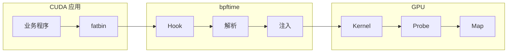

---

# 相关引用与实践

<div class="mt-8 text-center">

<div class="text-lg opacity-80 mb-8">
bpftime 的 GPU 扩展工作也被以下团队引用和实践
</div>

<div class="flex justify-center items-center gap-20 mt-12">
  <div class="flex flex-col items-center gap-4">
    
    <div class="text-sm opacity-60">阿里云</div>
  </div>
  <div class="flex flex-col items-center gap-4">
    
    <div class="text-sm opacity-60">字节跳动</div>
  </div>
</div>

<div class="mt-12 text-sm opacity-60 max-w-xl mx-auto">
在 GPU 可观测性、大模型性能分析等方向的相关工作中有所引用
</div>

</div>

---

# 接下来的方向

<div class="grid grid-cols-2 gap-8 mt-4">
<div>

### 已支持的能力

<div class="space-y-2 text-sm">
  <div class="flex items-center justify-between p-2 rounded bg-emerald-500/10"><span>NVIDIA CUDA 插桩</span><span class="text-emerald-400">Done</span></div>
  <div class="flex items-center justify-between p-2 rounded bg-emerald-500/10"><span>eBPF → PTX 编译</span><span class="text-emerald-400">Done</span></div>
  <div class="flex items-center justify-between p-2 rounded bg-emerald-500/10"><span>GPU Map</span><span class="text-emerald-400">Done</span></div>
  <div class="flex items-center justify-between p-2 rounded bg-emerald-500/10"><span>CPU-GPU 统一观测</span><span class="text-emerald-400">Done</span></div>
  <div class="flex items-center justify-between p-2 rounded bg-emerald-500/10"><span>CLC 策略框架集成</span><span class="text-emerald-400">Done</span></div>
</div>

</div>
<div>

### 进行中 / 规划

<div class="space-y-2 text-sm">
  <div class="flex items-center justify-between p-2 rounded bg-yellow-500/10"><span>AMD ROCm 支持</span><span class="text-yellow-400">WIP</span></div>
  <div class="flex items-center justify-between p-2 rounded bg-blue-500/10"><span>Intel Level Zero 支持</span><span class="text-blue-400">Plan</span></div>
  <div class="flex items-center justify-between p-2 rounded bg-blue-500/10"><span>验证更多生产环境场景</span><span class="text-blue-400">Plan</span></div>
</div>

</div>
</div>

<div class="mt-6 text-center">
  <div class="inline-block px-6 py-3 rounded-lg bg-gradient-to-r from-emerald-500/20 to-cyan-500/20 border border-emerald-500/30">
    <strong>目标</strong>：成为 Vendor-Neutral 的 GPU 可编程观测框架
  </div>
  <div class="mt-2 text-xs opacity-60">
    Vendor-Neutral：不绑定特定 GPU 厂商，支持 NVIDIA/AMD/Intel 等多平台
  </div>
</div>

---
layout: center
class: text-center
---

<div class="text-4xl font-bold leading-relaxed">
<span class="bg-gradient-to-r from-emerald-400 to-cyan-400 bg-clip-text text-transparent">GPU</span> 不再是 eBPF 体系之外的单独设备
</div>

<div class="text-xl mt-8 opacity-70 max-w-2xl mx-auto leading-relaxed">
而是可以与 CPU、内核、网络一起纳入<br>
<span class="text-emerald-400">统一的可编程观测与控制平面</span>
</div>

<div class="mt-12 text-lg opacity-60 max-w-2xl mx-auto leading-relaxed">
在整个异构计算栈上具备统一语言和工具之后，<br>
关于性能、可靠性和多租户公平性的一些长期问题，<br>
可以用更系统、更可编程的方式来分析和解决。
</div>

---
layout: center
class: text-center
---

<div class="text-6xl font-bold bg-gradient-to-r from-emerald-400 via-cyan-400 to-blue-400 bg-clip-text text-transparent">
Thanks!
</div>

<div class="mt-8 text-xl opacity-80">
特别感谢 <span class="text-emerald-400 font-semibold">@Officeyutong</span> 和 <span class="text-cyan-400 font-semibold">@yunwei37</span> 的帮助！
</div>

<div class="mt-12 flex justify-center">
  <a href="https://github.com/eunomia-bpf/bpftime" target="_blank" 
    class="px-8 py-4 rounded-xl bg-gradient-to-r from-emerald-500/20 to-cyan-500/20 border border-emerald-500/30 hover:border-emerald-400/50 transition-all flex items-center gap-3 text-xl">
    <carbon-logo-github class="text-2xl" />
    <span>github.com/eunomia-bpf/bpftime</span>
  </a>
</div>

<div class="mt-12 opacity-50 text-sm max-w-2xl mx-auto leading-relaxed">
参考资料：bpftime GPU 示例文档、《GPU Profiling: Extending eBPF to GPUs》、《基于 eBPF 的大模型性能分析及慢节点检测》、co-processor-demo/scheduler
</div>
